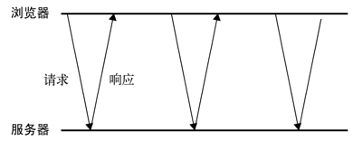
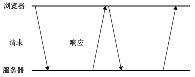

# Ajax 与 Comet

##XMLHttpRequest对象

```js
function createXHR(){
    if (typeof XMLHttpRequest != "undefined"){
    	return new XMLHttpRequest();
    } else if (typeof ActiveXObject != "undefined"){
        if (typeof arguments.callee.activeXString != "string"){
            var versions = [ "MSXML2.XMLHttp.6.0", "MSXML2.XMLHttp.3.0","MSXML2.XMLHttp"],
            	i, len;
            for (i=0,len=versions.length; i < len; i++){
            	try {
            		new ActiveXObject(versions[i]);
            		arguments.callee.activeXString = versions[i];
            		break;
           		} catch (ex){
            		//跳过
            	}
        	}
    	}
    	return new ActiveXObject(arguments.callee.activeXString);
    } else {
    	throw new Error("No XHR object available.");
    }
}
```

这个函数中新增的代码首先检测原生 XHR 对象是否存在，如果存在则返回它的新实例。如果原生对象不存在，则检测 ActiveX 对象。如果这两种对象都不存在，就抛出一个错误。然后，就可以使用下面的代码在所有浏览器中创建 XHR 对象了。
```var xhr = createXHR();```

1. **XHR的用法**

   在使用XHR对象时，要调用的第一个方法是 open()，它接受3个参数：要发送的请求的类型（get，post 等）、请求的URL和表示是否异步发送请求的布尔值。

   ```js
   xhr.open("get","example.php",false);
   ```

   折行代码会启动一个针对example.php的GET请求。open()方法并不会真正发送请求，而只是启动一个请求以备发送。

   要发送特定的请求，必须像下面这样调用send()方法：

   ```js
   xhr.open("get","example.php",false);
   xhr.send(null)
   ```

   send()方法介绍一个参数，既要作为请求主体发送的数据。如果不需要通过请求主体发送数据，则必须传入null，因为这个参数对有些浏览器来说是必需的。调用send()之后，请求就会被分派到服务器。

   由于这次请求是同步的，JavaScript代码会等到服务器响应之后再继续执行。在收到响应后，响应的数据会自动填充XHR对象的属性。

   * responseText：作为相应主体被返回的文本
   * responseXML：如果相应的内容类型是“text/xml”或“application/xml”,这个属性中将保存饱含着相应数据的XML DOM文档。
   * status：相应的HTTP状态
   * statusText：HTTP状态说明

   在接收到响应后，第一步是检查status属性，以确定响应已经成功返回，一般来说，可以将HTTP状态代码为200作为成功的标志。此时，responseText属性的内容已经就绪，而且在内容类型正确的情况下，responseXML也应该能够访问了。此外，状态代码为304表示请求的资源并没有被修改，可以直接使用浏览器中缓存的版本；当然，也意味着响应时有效的。

   ```js
   // 检查上述这两种状态代码
   xhr.open("get", "example.txt", false);
   xhr.send(null);
   if ((xhr.status >= 200 && xhr.status < 300) || xhr.status == 304){
   	alert(xhr.responseText);
   } else {
   	alert("Request was unsuccessful: " + xhr.status);
   }
   ```

   > 我们建议读者要通过检测 status 来决定下一步的操作，不要依赖 statusText，因为后者在跨浏览器使用时不太可靠。另外，无论内容类型是什么，响应主体的内容都会保存到 responseText 属性中；而对于非 XML 数据而言， responseXML 属性的值将为 null。

   多数情况下，我们还是要发送异步请求，才能让JavaScript继续执行而不必等待响应。此时，可以检测XHR对象的 **readyState** 属性，该属性表示请求/响应过程的当前活动阶段。

   * 0:未初始化。尚未调用open()方法
   * 1:启动。已经调用open()方法，但尚未调用send()方法
   * 2:发送。已经调用send()方法，但尚未接收到响应
   * 3:接收。已经接收到部分响应数据。
   * 4:完成。已经接收到全部响应数据，而且已经可以在客户端使用了。

   只要 readyState 属性的值由一个值变成另一个值，都会触发一次 **readystatechange** 事件。可以利用这个事件来检测每次状态变化后 readyState 的值。通常，我们只对 readyState 值为 4 的阶段感兴趣，因为这时所有数据都已经就绪。不过，必须在调用 open()之前指定 onreadystatechange事件处理程序才能确保跨浏览器兼容性。

   ```js
   var xhr = createXHR();
   xhr.onreadystatechange = function(){
       if (xhr.readyState == 4){
           if ((xhr.status >= 200 && xhr.status < 300) || xhr.status == 304){
           	alert(xhr.responseText);
           } else {
           	alert("Request was unsuccessful: " + xhr.status);
           }
       }
   };
   xhr.open("get", "example.txt", true);
   xhr.send(null);
   ```

   以上代码利用 DOM 0 级方法为 XHR 对象添加了事件处理程序，原因是并非所有浏览器都支持 DOM 2级方法。与其他事件处理程序不同，这里没有向 onreadystatechange 事件处理程序中传递 event 对象；必须通过 XHR 对象本身来确定下一步该怎么做。

   另外，在接收到响应之前还可以调用 abort()方法来取消异步请求，如下所示：
   **xhr.abort();**
   调用这个方法后， XHR 对象会停止触发事件，而且也不再允许访问任何与响应有关的对象属性。在终止请求之后，还应该对 XHR 对象进行解引用操作。由于内存原因，不建议重用 XHR 对象。

2. **HTTP头部信息**

   每个 HTTP 请求和响应都会带有相应的头部信息。XHR 对象也提供了操作这两种头部（即请求头部和响应头部）信息的方法。

   默认情况下，在发送 XHR 请求的同时，还会发送下列头部信息。

   * Accept：浏览器能够处理的内容类型。
   * Accept-Charset：浏览器能够显示的字符集。
   * Accept-Encoding：浏览器能够处理的压缩编码。
   * Accept-Language：浏览器当前设置的语言。
   * Connection：浏览器与服务器之间连接的类型。
   * Cookie：当前页面设置的任何 Cookie。
   * Host：发出请求的页面所在的域 。
   * Referer：发出请求的页面的 URI。注意， HTTP 规范将这个头部字段拼写错了，为保证与规范一致，也只能将错就错了。（这个英文单词的正确拼法应该是 referrer。）
   * User-Agent：浏览器的用户代理字符串。

   虽然不同浏览器实际发送的头部信息会有所不同，但以上列出的基本上是所有浏览器都会发送的。使用 **setRequestHeader()方法可以设置自定义的请求头部信息**。这个方法接受两个参数：头部字段的名称和头部字段的值。要成功发送请求头部信息，必须在调用 open()方法之后且调用 send()方法之前调用 setRequestHeader()

   ```js
   xhr.open("get", "example.php", true);
   xhr.setRequestHeader("MyHeader", "MyValue");
   xhr.send(null);
   ```

   服务器在接收到这种自定义的头部信息之后，可以执行相应的后续操作。我们建议读者使用自定义的头部字段名称，不要使用浏览器正常发送的字段名称，否则有可能会影响服务器的响应。有的浏览器允许开发人员重写默认的头部信息，但有的浏览器则不允许这样做。

   调用 XHR 对象的 **getResponseHeader()方法并传入头部字段名称，可以取得相应的响应头部信息。**而调用 getAllResponseHeaders()方法则可以取得一个包含所有头部信息的长字符串。

   ```js
   var myHeader = xhr.getResponseHeader("MyHeader");
   var allHeaders = xhr.getAllResponseHeaders();
   ```

   在服务器端，也可以利用头部信息向浏览器发送额外的、结构化的数据。

3. **GET请求**

   GET 是最常见的请求类型，最常用于向服务器查询某些信息。必要时，可以将查询字符串参数追加到 URL 的末尾，以便将信息发送给服务器。对 XHR 而言，位于传入 open()方法的 URL 末尾的查询字符串必须经过正确的编码才行。

   使用 GET 请求经常会发生的一个错误，就是查询字符串的格式有问题。查询字符串中每个参数的名称和值都必须使用 encodeURIComponent()进行编码，然后才能放到 URL 的末尾；而且所有名-值对儿都必须由和号（&）分隔。

   ```js
   xhr.open("get", "example.php?name1=value1&name2=value2", true);
   //向现有 URL 的末尾添加查询字符串参数
   function addURLParam(url, name, value) {
       url += (url.indexOf("?") == -1 ? "?" : "&");
       url += encodeURIComponent(name) + "=" + encodeURIComponent(value);
       return url;
   }
   ```

4. **POST请求**

   使用频率仅次于 GET 的是 POST 请求，通常用于向服务器发送应该被保存的数据。 POST 请求应该把数据作为请求的主体提交，而 GET 请求传统上不是这样。 POST 请求的主体可以包含非常多的数据，而且格式不限。在 open()方法第一个参数的位置传入"post"，就可以初始化一个 POST 请求。

   ```js
   xhr.open("post", "example.php", true);
   ```

   发送 POST 请求的第二步就是向 send()方法中传入某些数据。由于 XHR 最初的设计主要是为了处理 XML，因此可以在此传入 XML DOM 文档，传入的文档经序列化之后将作为请求主体被提交到服务器。当然，也可以在此传入任何想发送到服务器的字符串。

   默认情况下，服务器对POST请求和提交WEB表单的请求并不会一视同仁。因此，服务器端必须有程序来读取发送过来的原始数据，并从中解析出有用的部分。不过，我们可以使用XHR来模仿表单提交：

   首先将 Content-Type头部信息设置为 application/x-www-from-urlencoded,也就是表单提交时的内容类型。

   其次是以适当的格式创建一个字符串。

   ```js
   function submitData(){
       var xhr = createXHR();
       xhr.onreadystatechange = function(){
       	if (xhr.readyState == 4){
       		if ((xhr.status >= 200 && xhr.status < 300) || xhr.status == 304){
       			alert(xhr.responseText);
       		} else {
       			alert("Request was unsuccessful: " + xhr.status);
       		}
       	}
       };
       xhr.open("post", "postexample.php", true);
       xhr.setRequestHeader("Content-Type", "application/x-www-form-urlencoded");
       var form = document.getElementById("user-info");
       xhr.send(serialize(form));
   }
   ```

   ​

##XMLHttpRequest 2级

1. **FormData**

    XMLHttpRequest 2 级为此定义了FormData 类型。FormData 为序列化表单以及创建与表单格式相同的数据（用于通过 XHR 传输）提供了便利。

   ```js
   var data = new FormDate();
   data.append('name','Nicholas')
   ```

    append()方法接收两个参数：键和值，分别对应表单字段的名字和字段中包含的值。可以像这样添加任意多个键值对儿。而通过向 FormData 构造函数中传入表单元素，也可以用表单元素的数据预先向其中填入键值对儿:

   `var data = new FormData(document.forms[0]);`

   创建了 FormData 的实例后，可以将它直接传给 XHR 的 send()方法:

   ```js
   xhr.open("post","postexample.php", true);
   var form = document.getElementById("user-info");
   xhr.send(new FormData(form));
   ```

   使用 FormData 的方便之处体现在不必明确地在 XHR 对象上设置请求头部。 XHR 对象能够识别传入的数据类型是 FormData 的实例，并配置适当的头部信息。

   支持 FormData 的浏览器有 Firefox 4+、 Safari 5+、 Chrome 和 Android 3+版 WebKit。

2. **超时设定**

   IE8 为 XHR 对象添加了一个 timeout 属性，表示请求在等待响应多少毫秒之后就终止。在给timeout 设置一个数值后，如果在规定的时间内浏览器还没有接收到响应，那么就会触发 timeout 事件，进而会调用 ontimeout 事件处理程序。这项功能后来也被收入了 XMLHttpRequest 2 级规范中。

   ```js
   xhr.open("get", "timeout.php", true);
   xhr.timeout = 1000; //将超时设置为 1 秒钟（仅适用于 IE8+）
   xhr.ontimeout = function(){
     alert("Request did not return in a second.");
   };
   xhr.send(null);
   ```

   请求终止时，会调用 ontimeout 事件处理程序。但此时 readyState可能已经改变为 4 了，这意味着会调用 onreadystatechange 事件处理程序。可是，如果在超时终止请求之后再访问 status 属性，就会导致错误。为避免浏览器报告错误，可以将检查 status 属性的语句封装在一个 try-catch 语句当中。
   在写作本书时， IE 8+仍然是唯一支持超时设定的浏览器。

3. **overrideMimeType()方法**

   Firefox 最早引入了 overrideMimeType()方法，用于重写 XHR 响应的 MIME 类型。这个方法后来也被纳入了 XMLHttpRequest 2 级规范。因为返回响应的 MIME 类型决定了 XHR 对象如何处理它，所以提供一种方法能够重写服务器返回的 MIME 类型是很有用的。

   ```js
   var xhr = createXHR();
   xhr.open("get", "text.php", true);
   xhr.overrideMimeType("text/xml");
   xhr.send(null);
   ```

   这个例子强迫 XHR 对象将响应当作 XML 而非纯文本来处理。调用overrideMimeType()必须在send()方法之前，才能保证重写响应的 MIME 类型。
   支持 overrideMimeType()方法的浏览器有 Firefox、 Safari 4+、 Opera 10.5 和 Chrome。

##进度事件

Progress Events 规范是 W3C 的一个工作草案，定义了与客户端服务器通信有关的事件。这些事件最早其实只针对 XHR 操作，但目前也被其他 API 借鉴。有以下 6 个进度事件。

 loadstart：在接收到响应数据的第一个字节时触发。
 progress：在接收响应期间持续不断地触发。
 error：在请求发生错误时触发。
 abort：在因为调用 abort()方法而终止连接时触发。
 load：在接收到完整的响应数据时触发。
 loadend：在通信完成或者触发 error、 abort 或 load 事件后触发。

每个请求都从触发 loadstart 事件开始，接下来是一或多个 progress 事件，然后触发 error、abort 或 load 事件中的一个，最后以触发 loadend 事件结束。

1. **load事件**

   响应接收完毕后将触发 load 事件, onload 事件处理程序会接收到一个 event 对象，其 target 属性就指向 XHR 对象实例，因而可以访问到 XHR 对象的所有方法和属性。

   并非所有浏览器都为这个事件实现了适当的事件对象。结果，开发人员还是要像下面这样被迫使用 XHR 对象变量。

   ```js
   var xhr = createXHR();
   xhr.onload = function(){
       if ((xhr.status >= 200 && xhr.status < 300) || xhr.status == 304){
       	alert(xhr.responseText);
       } else {
       	alert("Request was unsuccessful: " + xhr.status);
       }
   };
   xhr.open("get", "altevents.php", true);
   xhr.send(null);
   ```

   只要浏览器接收到服务器的响应，不管其状态如何，都会触发 load 事件。而这意味着你必须要检查 status 属性，才能确定数据是否真的已经可用了。 Firefox、 Opera、 Chrome 和 Safari 都支持 load事件。

2. **progress事件**

   Mozilla 对 XHR 的另一个革新是添加了 progress 事件，这个事件会在浏览器接收新数据期间周期性地触发。而 onprogress 事件处理程序会接收到一个 event 对象，其 target 属性是 XHR 对象，但包含着三个额外的属性： lengthComputable、 position 和 totalSize。

   **lengthComputable**是一个表示进度信息是否可用的布尔值， 

   **position** 表示已经接收的字节数， 

   **totalSize** 表示根据Content-Length 响应头部确定的预期字节数。

   有了这些信息，我们就可以为用户创建一个进度指示器了。

   ```js
   var xhr = createXHR();
   xhr.onload = function(event){
       if ((xhr.status >= 200 && xhr.status < 300) || xhr.status == 304){
       	alert(xhr.responseText);
       } else {
       	alert("Request was unsuccessful: " + xhr.status);
       }
   };
   xhr.onprogress = function(event){
   	var divStatus = document.getElementById("status");
       if (event.lengthComputable){
       	divStatus.innerHTML = "Received " + event.position + " of " + event.totalSize +" bytes";
       }
   };
   xhr.open("get", "altevents.php", true);
   xhr.send(null);
   ```

##跨源资源共享

通过 XHR 实现 Ajax 通信的一个主要限制，来源于跨域安全策略。默认情况下， XHR 对象只能访问与包含它的页面位于同一个域中的资源。这种安全策略可以预防某些恶意行为。

CORS（Cross-Origin Resource Sharing，跨源资源共享）是 W3C 的一个工作草案，定义了在必须访问跨源资源时，浏览器与服务器应该如何沟通。 CORS 背后的基本思想，就是使用自定义的 HTTP 头部让浏览器与服务器进行沟通，从而决定请求或响应是应该成功，还是应该失败。

1. **IE对CORS的实现**

   微软在 IE8 中引入了 XDR（XDomainRequest）类型。这个对象与 XHR 类似，但能实现安全可靠的跨域通信。 XDR 对象的安全机制部分实现了 W3C 的 CORS 规范。以下是 XDR 与 XHR 的一些不同之处。

    cookie 不会随请求发送，也不会随响应返回。
    只能设置请求头部信息中的 Content-Type 字段。
    不能访问响应头部信息。
    只支持 GET 和 POST 请求

   被请求的资源可以根据它认为合适的任意数据（用户代理、来源页面等）来决定是否设置 Access-Control- Allow-Origin 头部。作为请求的一部分， Origin 头部的值表示请求的来源域，以便远程资源明确地识别 XDR 请求。

   XDR 对象的使用方法与 XHR 对象非常相似。也是创建一个 XDomainRequest 的实例，调用 open()方法，再调用 send()方法。但与 XHR 对象的 open()方法不同， XDR 对象的 open()方法只接收两个参数：请求的类型和 URL。

   所有 XDR 请求都是异步执行的，不能用它来创建同步请求。请求返回之后，会触发 load 事件，响应的数据也会保存在 responseText 属性中。

   ```js
   var xdr = new XDomainRequest();
   xdr.onload = function(){
   	alert(xdr.responseText);
   };
   xdr.onerror = function(){ //指定一个 onerror 事件
   	alert("An error occurred.");
   };
   xdr.open("get", "http://www.somewhere-else.com/page/");
   xdr.send(null);
   ```

   在接收到响应后，你只能访问响应的原始文本；没有办法确定响应的状态代码。而且，只要响应有效就会触发 load 事件，如果失败（包括响应中缺少 Access-Control-Allow-Origin 头部）就会触发 error 事件。

   在请求返回前调用 abort()方法可以终止请求：
   `xdr.abort(); //终止请求`

   与 XHR 一样， XDR 对象也支持 timeout 属性以及 ontimeout 事件处理程序。

   ```js
   var xdr = new XDomainRequest();
   xdr.onload = function(){
   	alert(xdr.responseText);
   };
   xdr.onerror = function(){
   	alert("An error occurred.");
   };
   xdr.timeout = 1000;
   xdr.ontimeout = function(){
   	alert("Request took too long.");
   };
   xdr.open("get", "http://www.somewhere-else.com/page/");
   xdr.send(null);
   ```

   为支持 POST 请求， XDR 对象提供了 contentType 属性，用来表示发送数据的格式

   ```js
   var xdr = new XDomainRequest();
   xdr.onload = function(){
   	alert(xdr.responseText);
   };
   xdr.onerror = function(){
   	alert("An error occurred.");
   };
   xdr.open("post", "http://www.somewhere-else.com/page/");
   xdr.contentType = "application/x-www-form-urlencoded";
   xdr.send("name1=value1&name2=value2");
   ```

   这个属性是通过 XDR 对象影响头部信息的唯一方式。

2. **其他浏览器对CORS的实现**

   Firefox 3.5+、 Safari 4+、 Chrome、 iOS 版 Safari 和 Android 平台中的 WebKit 都通过 XMLHttpRequest对象实现了对 CORS 的原生支持。在尝试打开不同来源的资源时，无需额外编写代码就可以触发这个行为。 要请求位于另一个域中的资源，使用标准的 XHR 对象并在 open()方法中传入绝对 URL 即可。

   ```js
   var xhr = createXHR();
   xhr.onreadystatechange = function(){
       if (xhr.readyState == 4){
           if ((xhr.status >= 200 && xhr.status < 300) || xhr.status == 304){
               alert(xhr.responseText);
           } else {
               alert("Request was unsuccessful: " + xhr.status);
           }
        }
   };
   xhr.open("get", "http://www.somewhere-else.com/page/", true);
   xhr.send(null);
   ```

   与 IE 中的 XDR 对象不同，通过跨域 XHR 对象可以访问 status 和 statusText 属性，而且还支持同步请求。跨域 XHR 对象也有一些限制，但为了安全这些限制是必需的。以下就是这些限制。

    不能使用 setRequestHeader()设置自定义头部。
    不能发送和接收 cookie。
    调用 getAllResponseHeaders()方法总会返回空字符串。

   由于无论同源请求还是跨源请求都使用相同的接口，因此对于本地资源，最好使用相对 URL，在访问远程资源时再使用绝对 URL。这样做能消除歧义，避免出现限制访问头部或本地 cookie 信息等问题。

3. **Preflighted Reqeusts***

   CORS 通过一种叫做 Preflighted Requests 的透明服务器验证机制支持开发人员使用自定义的头部、GET 或 POST 之外的方法，以及不同类型的主体内容。在使用下列高级选项来发送请求时，就会向服务器发送一个 Preflight 请求。这种请求使用 OPTIONS 方法，发送下列头部。

    Origin：与简单的请求相同。
    Access-Control-Request-Method：请求自身使用的方法。
    Access-Control-Request-Headers：（可选）自定义的头部信息，多个头部以逗号分隔。

   发送这个请求后，服务器可以决定是否允许这种类型的请求。服务器通过在响应中发送如下头部与浏览器进行沟通。

    Access-Control-Allow-Origin：与简单的请求相同。
    Access-Control-Allow-Methods：允许的方法，多个方法以逗号分隔。
    Access-Control-Allow-Headers：允许的头部，多个头部以逗号分隔。
    Access-Control-Max-Age：应该将这个 Preflight 请求缓存多长时间（以秒表示）。

   Preflight 请求结束后，结果将按照响应中指定的时间缓存起来。而为此付出的代价只是第一次发送这种请求时会多一次 HTTP 请求。
   支持 Preflight 请求的浏览器包括 Firefox 3.5+、 Safari 4+和 Chrome。 IE 10 及更早版本都不支持。

4. **带凭据的请求***

   默 认 情 况 下， 跨 源 请 求不 提 供 凭 据（cookie 、 HTTP 认 证 及 客户 端 SSL 证明 等 ）。 通 过 将withCredentials 属性设置为 true，可以指定某个请求应该发送凭据。如果服务器接受带凭据的请求，会用下面的 HTTP 头部来响应。

   `Access-Control-Allow-Credentials: true`

   如果发送的是带凭据的请求，但服务器的响应中没有包含这个头部，那么浏览器就不会把响应交给JavaScript（于是， responseText 中将是空字符串， status 的值为 0，而且会调用 onerror()事件处理程序）。另外，服务器还可以在 Preflight 响应中发送这个 HTTP 头部，表示允许源发送带凭据的请求。

   支持 withCredentials 属性的浏览器有 Firefox 3.5+、 Safari 4+和 Chrome。 IE 10 及更早版本都不支持

5. **跨浏览器的CORS**

   检测 XHR 是否支持 CORS 的最简单方式，就是检查是否存在 withCredentials 属性。再结合检测 XDomainRequest 对象是否存在，就可以兼顾所有浏览器了。

   ```js
   function createCORSRequest(method, url){
       var xhr = new XMLHttpRequest();
       if ("withCredentials" in xhr){
       	xhr.open(method, url, true);
       } else if (typeof XDomainRequest != "undefined"){
       	xhr = new XDomainRequest();
       	xhr.open(method, url);
       } else {
       	xhr = null;
       }
       return xhr;
   }
   var request = createCORSRequest("get", "http://www.somewhere-else.com/page/");
   if (request){
       request.onload = function(){
       //对 request.responseText 进行处理
       };
       request.send();
   }
   ```

   Firefox、 Safari 和 Chrome 中的 XMLHttpRequest 对象与 IE 中的 XDomainRequest 对象类似，都提供了够用的接口，因此以上模式还是相当有用的。这两个对象共同的属性/方法如下。

    abort()：用于停止正在进行的请求。
    onerror：用于替代 onreadystatechange 检测错误。
    onload：用于替代 onreadystatechange 检测成功。
    responseText：用于取得响应内容。
    send()：用于发送请求

##其他跨域技术

1. **图像Ping**

   一个网页可以从任何网页中加载图像，不用担心跨域不跨域。这也是在线广告跟踪浏览量的主要方式。可以动态地创建图像，使用它们的 onload 和 onerror 事件处理程序来确定是否接收到了响应。

   动态创建图像经常用于图像 Ping。图像 Ping 是与服务器进行简单、单向的跨域通信的一种方式。请求的数据是通过查询字符串形式发送的，而响应可以是任意内容，但通常是像素图或 204 响应。通过图像 Ping，浏览器得不到任何具体的数据，但通过侦听 load 和 error 事件，它能知道响应是什么时候接收到的。

   ```js
   var img = new Image();
   img.onload = img.onerror = function(){
   	alert("Done!");
   };
   img.src = "http://www.example.com/test?name=Nicholas";
   ```

   图像 Ping 最常用于跟踪用户点击页面或动态广告曝光次数。图像 Ping 有两个主要的缺点，一是只能发送 GET 请求，二是无法访问服务器的响应文本。因此，图像 Ping 只能用于浏览器与服务器间的单向通信。

2. **JSONP**

   JSONP是JSON with padding（填充式JSON或参数式JSON）的简写，是应用JSON的一种新方法，在后来的Web服务中非常流行。JSONP看起来与JSON差不多，只不过是被包含在函数调用中的JSON

   ```js
   callback({"name":"Nicholas"})
   ```

   JSONP由两部分组成：回调函数和数据。回调函数是当响应到来时应该在页面中调用的函数。回调函数的名字一半时在请求中指定的。而数据就是传入回调函数中的JSON数据。下面是一个典型的 JSONP请求。

   ```html
   http://freegeoip.net/json/?callback=handleResponse
   ```

   JSONP是通过动态<script>元素来使用过的，使用时可以为src属性指定一个跨域URL。这里的<script>元素与元素类似，都有能力不受限制地从其他域加载资源。因为JSONP是有效的JavaScript代码，所以在请求完成后，即在JSONP响应加载到页面中以后，就会立即执行。

   ```js
   function handleResponse(response){
   	alert("You’ re at IP address " + response.ip + ", which is in " +
   	response.city + ", " + response.region_name);
   }
   var script = document.createElement("script");
   script.src = "http://freegeoip.net/json/?callback=handleResponse";
   document.body.insertBefore(script, document.body.firstChild);
   ```

   JSONP 之所以在开发人员中极为流行，主要原因是它非常简单易用。与图像 Ping 相比，它的优点在于能够直接访问响应文本，支持在浏览器与服务器之间双向通信。

   不足：

   首先， JSONP 是从其他域中加载代码执行。如果其他域不安全，很可能会在响应中夹带一些恶意代码，而此时除了完全放弃 JSONP 调用之外，没有办法追究。因此在使用不是你自己运维的 Web 服务时，一定得保证它安全可靠。
   其次，要确定 JSONP 请求是否失败并不容易。虽然 HTML5 给<script>元素新增了一个 onerror事件处理程序，但目前还没有得到任何浏览器支持。为此，开发人员不得不使用计时器检测指定时间内是否接收到了响应。但就算这样也不能尽如人意，毕竟不是每个用户上网的速度和带宽都一样。

3. **Comet**

   指的是一种更高级的 Ajax 技术（经常也有人称为“服务器推送”）。 Comet 则是一种服务器向页面推送数据的技术。 Comet 能够让信息近乎实时地被推送到页面上，非常适合处理体育比赛的分数和股票报价。

   有两种实现 Comet 的方式： **长轮询**和**流**。

   **长轮询**是传统轮询（也称为短轮询）的一个翻版，即浏览器定时向服务器发送请求，看有没有更新的数据。

   

   长轮询是页面发起一个到服务器的请求，然后服务器一直保持连接打开，直到有数据可发送。发送完数据之后，浏览器关闭连接，随即又发起一个到服务器的新请求。这一过程在页面打开期间一直持续不断。

   

   无论是短轮询还是长轮询，浏览器都要在接收数据之前，先发起对服务器的连接。两者最大的区别在于服务器如何发送数据。短轮询是服务器立即发送响应，无论数据是否有效，而长轮询是等待发送响应。轮询的优势是所有浏览器都支持，因为使用 XHR 对象和setTimeout()就能实现。而你要做的就是决定什么时候发送请求。

   **流** 不同于上述两种轮询，因为它在页面的整个生命周期内只使用一个 HTTP 连接。具体来说，就是浏览器向服务器发送一个请求，而服务器保持连接打开，然后周期性地向浏览器发送数据。

   所有服务器端语言都支持打印到输出缓存然后刷新（将输出缓存中的内容一次性全部发送到客户端）的功能。而这正是实现 HTTP 流的关键所在。

   在 Firefox、 Safari、 Opera 和 Chrome 中，通过侦听 readystatechange 事件及检测 readyState的值是否为 3，就可以利用 XHR 对象实现 HTTP 流。在上述这些浏览器中，随着不断从服务器接收数据， readyState 的值会周期性地变为 3。当 readyState 值变为 3 时， responseText 属性中就会保存接收到的所有数据。此时，就需要比较此前接收到的数据，决定从什么位置开始取得最新的数据。使用 XHR 对象实现 HTTP 流的典型代码如下所示。

   ```js
   function createStreamingClient(url, progress, finished){
   	var xhr = new XMLHttpRequest(),
   			received = 0;
   	xhr.open("get", url, true);
   	xhr.onreadystatechange = function(){
   		var result;
   		if (xhr.readyState == 3){
               //只取得最新数据并调整计数器
               result = xhr.responseText.substring(received);
               received += result.length;
               //调用 progress 回调函数
               progress(result);
   		} else if (xhr.readyState == 4){
   			finished(xhr.responseText);
   		}
   	};
   	xhr.send(null);
   	return xhr;
   }
   var client = createStreamingClient("streaming.php", function(data){
           alert("Received: " + data);
       }, function(data){
           alert("Done!");
       });
   ```

   这个 createStreamingClient()函数接收三个参数：要连接的 URL、在接收到数据时调用的函
   数以及关闭连接时调用的函数。有时候，当连接关闭时，很可能还需要重新建立，所以关注连接什么时候关闭还是有必要的。

   只要 readystatechange 事件发生，而且 readyState 值为 3，就对 responseText 进行分割以取得最新数据。这里的 received 变量用于记录已经处理了多少个字符，每次 readyState 值为 3 时都递增。然后，通过 progress 回调函数来处理传入的新数据。而当 readyState 值为 4 时，则执行finished 回调函数，传入响应返回的全部内容

4. **服务器发送事件**

5. **Web Sockets**

6. **SSE与Web Sockets**

## 安全

