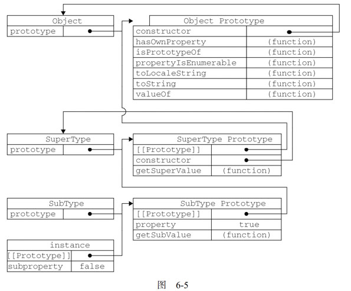

## 对象

js的对象是无序属性的集合，其属性可以包含基本值、对象或者函数。是一组没有特定顺序的值。对象的每个属性或方法都有一个名字，而每个名字都映射到一个值。

每个对象都是基于一个引用类型创建的。

### 理解对象

* 属性类型

  * 数据属性

    数据属性包含一个数据值的位置。在这个位置可以读取和写入值。

    > [[Configurable]] 能否通过delete删除属性重新定义，能否修改属性特性，或者修改为访问器属性。默认true

    > [[Enumerable]] 能否通过for-in循环返回属性。默认true

    > [[Writable]] 能否修改属性的值。默认true

    > [[Value]] 包含这个属性的值。

  * 访问器属性

    访问器属性不包含数据值；它们包含一对儿 getter 和 setter 函数(非必需)
    在读取访问器属性时，会调用 getter 函数，这个函数负责返回有效的值；在写入访问器属性时，会调用setter 函数并传入新值，这个函数负责决定如何处理数据。

    > [[Configurable]]

    > [[Enumerable]]

    > [[Get]]  在读取属性时调用的函数。默认值为 undefined

    > [[Set]]  在写入属性时调用的函数。默认值为 undefined

  * 修改属性的特性：Object.defineProperty() 

    三个参数：属性所在对象，属性名，描述符对象

    ```javascript
    var person = {};
    Object.definProperty(person,"name",{
      configurable: false, //一旦把属性定义为不可配置的，就不能再把它变回可配置了
      writable:false,
      value:"Nicholas"
    })
    ```

    ```javascript
    var book = {
    	_year:2004,
    	edition:1
    }
    //设置访问器属性year
    Object.defineProperty(book,"year",{
    	get:function(){
    		return this._year;
    	},
    	set:function(newValue){
    		if(newValue>2004){
    			this._year=newValue;
    			this.edition+=newValue-2004
    		}
    	}
    });
    book.year = 2005;
    alert(book.edition); //2
    ```

    ​

* 定义多个属性

  ```javascript
  var book = {};
  Object.defineProperties(book,{
    _year:{
      value:2004
    },
    edition:{
      value:1
    },
    year:{
      get:function(){
        return this._year;
      },
      set:function(newValue){
        if(newValue>2004){
          this._year =newValue;
          this.edition += newValue - 2004;
        }
      }
    }
  })
  ```

  > 两个对象参数：要添加的属性所在对象，属性对象

* 读取属性的特性

  > Object.getOwnPropertyDescriptor()
  >
  > 两个参数：属性所在对象，要读取其描述符的属性名称

  ```javascript
  var descriptor = Object.getOwnPropertyDescriptor(book,"_year");
  alert(descriptor.vaure);	//2004
  alert(descriptor.configurable); //false
  var descriptor = Object.getOwnPropertyDescriptor(book, "year");
  alert(descriptor.value); //undefined
  alert(descriptor.enumerable); //false
  alert(typeof descriptor.get); //"function"
  ```

### 创建对象

* 工厂模式

  用函数来封装以特定接口创建对象,🉑️解决了创建多个相似对象的问题，但却没解决对象识别问题（即怎么知道一个对象的类型）

  ```javascript
  function createPerson(name,age,job){
    var o = new Object();
    o.name = name;
    o.age = age;
    o.job = job;
    o.sayName = function(){
      alert(this.name);
    }
    return o;
  }
  var person1 = createPerson("Nicholas",29,"Software Engineer");
  var person2 = createPerson("chris",32,"Doctor");
  ```

* 构造函数模式

  实例的constructor（构造函数）属性，都指向Person这个构造函数。

  创建自定义的构造函数意味着将来可以将它的实例标识为一种特定的类型；而这正是构造函数模式胜过工厂模式的地方。

  ```javascript
  function Person(name,age,job){
    this.name=name;
    this.age=age;
    this.job=job;
    this.sayName = function(){
      alert(this.name);
    };
  }
  //当做构造函数使用
  var person1 = new Person("Nicholas",29,"Software Engineer");
  var person2 = new Person("chris",32,"Doctor");
  //作为普通函数调用，this指向window,win拥有了属性和方法
  Person("Greg",29,"Software Engineer"); // 添加到window
  window.sayName();//Greg
  //在另一个对象的作用域中调用,this指向o对象，o对象拥有了属性和方法
  var o =new object();
  Persion.call(o,"kristem",25,"kurse");
  o.sayName(); //kristem
  ```
  > 任何函数，只要通过 new 操作符来调用，那它就可以作为构造函数；而
  > 任何函数，如果不通过 new 操作符来调用，那它跟普通函数也不会有什么两样。
  >
  > 缺点：每个方法都要在每个实例上重新创建一遍,不同实例额上的同名函数是不相等的。

  把函数定义转移到构造函数外部解决，但是全局作用域污染

  ```javascript
  function Person(name, age, job){
  this.name = name;
  this.age = age;
  this.job = job;
  this.sayName = sayName;
  }
  function sayName(){
  alert(this.name);
  }
  var person1 = new Person("Nicholas", 29, "Software Engineer");
  var person2 = new Person("Greg", 27, "Doctor");
  ```

* 原型模式

  每个函数都有一个prototype（原型）属性，这个属性是一个指针，指向一个对象，而这个对象的用途是包含可以由特定类型的所有实例共享的属性和方法

  ```javascript
  function Person(){}
  Person.prototype.name = "Nicholas";
  Person.prototype.age = 29;
  Person.prototype.job = "terchear";
  Person.prototype.sayName = function(){
   alert(this.name) 
  };
  var person1 = new Person();
  person1.sayName();//Nicholas
  var person2 = new Person();
  person2.sayName();//Nicholas
  person1.sayName == person2.sayName; //true
  ```

  ​

  * 理解原型对象

    > 创建的每个函数都有一个prototype(原型)属性，这个属性是个指针，指向一个对象。这个对象是通过调用构造函数创建的对象实例的原型对象。使用原型对象可以让所有对象实例共享它所包含的属性和方法。
    >
    > 默认情况下，所有原型对象(prototype)都会自动获取一个constructor（构造函数）属性，这个属性包含一个指向prototype属性所在函数的指针。
    >
    > 通过构造函数创建的新实例内部都包含一个指针(__proto__)，指向构造函数的原型

    isPrototypeOf() 方法 判断实例对象是否指向这个构造函数的原型对象

    ```javascript
    Person.prototype.isPrototypeOf(person1) //true
    Person.prototype.isPrototypeOf(person2) //true
    ```

    Object.getPrototypeOf() 方法[ES5] 取得一个对象的原型

    ```javascript
    Object.getPrototypeOf(preson1)==Person.prototype //true
    Object.getPrototypeOf(preson1).name  //"Nicholas"
    ```
    > 读取对象属性时，搜索首先从对象实例本身开始，实例中没有继续搜索指针指向的原型对象。这正是多个对象实例共享原型所保存的属性和方法的基本原理
    >
    > 在实例对象中可以屏蔽原型中的属性访问，恢复的时候删除实例中的属性就行

    hasOwnProperty()方法可检测属性是否存在于实例中，还是原型中。

    ```javascript
    person1.hasOwnProperty("name") //person1的属性返回true
    ```

    Object.getOwnPropertyDescriptor() 方法[es5] 只能用于实例属性

  * 原型与in操作符

    * 单独使用in操作符会在通过对象能够访问给定属性时返回true，无论该属性是否存在于实例原型中

    * hasOwnProperty() 

      只在属性存在于实例中时才返回true

    * for-in 循环，返回的是所有能够通过对象访问的、可枚举的（enumerated）属性，其中即包括存在于实例中的属性，也包括存在于原型中的属性。

    * Object.keys() [ESC5] 

      接受一个对象作为参数，返回一个包含所有可枚举属性的字符串数组

    * Object.getOwnPropertyNames()

      得到所有实例属性，无论是否可枚举

  * 更简单的原型语法

    > 用一个包含所有属性和方法的对象字面量来重写整个原型对象

    ```javascript
    function Person{
    }
    Person.prototype = {
      constructor:Person, //重新定义构造函数的指向，用Object.defineProperty()设置不可枚举
      name:"nicholas",
      age:29,
      job:"Software Engineer",
      sayName:function(){
        alert(this.name)
      }
    }
    ```

    此用法constructor属性不再指向Person，相当于重写了默认的prototype对象，因此constructor属性也变成了新对象的constructor（指向Object构造函数）

  * 原型的动态性

    由于原型中查找值的过程是一次搜索，因此对原型对象所做的任何修改都能够立即从实例上反应出来。

    重写整个原型对象 等于切断构造函数与最初原型之间的联系。也切断了现有原型与之前已存在的对象实例之间的联系，他们引用的仍然是最初的原型

  * 原型对象的原型

    所有原生引用类型（Object、Array、String）都在其构造函数的原型上定义了方法

  * 原型对象的问题

    原型中所有属性是被很多实例共享的，这种共享对函数非常适合，对于那些包含基本值得属性倒也说得过去，可以在实例中覆盖原型中的属性。对于包含引用类型值的属性（数组）来说，问题比较严重。

    修改引用类型值，会在所有实例中体现出来

* 组合构造函数和原型模式

  > 构造函数模式用于定义实例属性，而原型模式用于定义方法和共享的属性。结果，每个实例都会有自己的一份实例属性的副本，但同时又共享着对方法的引用，最大限度地节省了内存。另外，这种混成模式还支持向构造函数传递参数；可谓是集两种模式之长。

  ```javascript
  function Person(name,age,job){
    this.name = name;
    this.age = age;
    this.job = job;
    this.friends = ["Shelby","Court"]
  }
  Person.prototype = {
    constructor : Person,
    sayName : function(){
      alert(this.name);
    }
  }
  var person1 = new Person("Nicholas", 29, "Software Engineer");
  var person2 = new Person("Greg", 27, "Doctor");
  person1.friends.push("Van");
  alert(person1.friends); //"Shelby,Count,Van"
  alert(person2.friends); //"Shelby,Count"
  alert(person1.friends === person2.friends); //false
  alert(person1.sayName === person2.sayName); //true
  ```

* 动态原型模式

  > 把所有信息都封装在了构造函数中，而通过在构造函数中初始化原型（仅在必要的情况下），又保持了同时使用构造函数和原型的优点。换句话说，可以通过检查某个应该存在的方法是否有效，来决定是否需要初始化原型

  ```javascript
  function Person(name, age, job){
  	//属性
  	this.name = name;
  	this.age = age;
  	this.job = job;
    	//方法
  	if (typeof this.sayName != "function"){
  		Person.prototype.sayName = function(){
  		alert(this.name);
  		};
  	}
  }
  ```

* 寄生构造函数模式

  > 这种模式的基本思想是创建一个函数，该函数的作用仅仅是封装创建对象的代码，然后再返回新创建的对象。
  >
  > 除了使用new操作符并把使用的包装函数叫做构造函数外，跟工厂模式没什么区别。

  ```javascript
  function Person(name, age, job){
      var o = new Object();
      o.name = name;
      o.age = age;
      o.job = job;
      o.sayName = function(){
      alert(this.name);
      };
      return o;
  }
  var friend = new Person("Nicholas", 29, "Software Engineer");
  friend.sayName(); //"Nicholas"
  ```
  这个模式在特殊情况下用来为对象创建构造函数。

  ```javascript
  function SpecialArray(){
    	//创建数组
  	var values = new Array();
  	//添加值
  	values.push.apply(values, arguments);
  	//添加方法
  	values.toPipedString = function(){
  		return this.join("|");
  	};
  	//返回数组
  	return values;
  }
  var colors = new SpecialArray("red", "blue", "green");
  alert(colors.toPipedString()); //"red|blue|green"
  ```

  > 返回的对象与构造函数或者与构造函数的原型属
  > 性之间没有关系；也就是说，构造函数返回的对象与在构造函数外部创建的对象没有什么不同。为此，不能依赖 instanceof 操作符来确定对象类型。由于存在上述问题，我们建议在可以使用其他模式的情况下，不要使用这种模式。

* 稳妥构造函数模式

  > 所谓稳妥对象，指的是没有公共属性，而且其方法也不引用 this 的对象。稳妥对象最适合在一些安全的环境中（这些环境中会禁止使用 this 和 new），或者在防止数据被其他应用程序（如 Mashup程序）改动时使用。稳妥构造函数遵循与寄生构造函数类似的模式，但有两点不同：一是新创建对象的实例方法不引用 this；二是不使用 new 操作符调用构造函数

  ```javascript
  function Person(name, age, job){
      //创建要返回的对象
      var o = new Object();
      //可以在这里定义私有变量和函数
      //添加方法
      o.sayName = function(){
      	alert(name);
      };
      //返回对象
      return o;
  }
  var friend = Person("Nicholas", 29, "Software Engineer");
  friend.sayName(); //"Nicholas"

  ```

  > 变量 friend 中保存的是一个稳妥对象，而除了调用 sayName()方法外，没有别的方式可以访问其数据成员。
  >
  > 与寄生构造函数模式类似，使用稳妥构造函数模式创建的对象与构造函数之间也没有什么关系，因此 instanceof 操作符对这种对象也没有意义

### 继承

原型链是实现继承的主要方法。

* 原型链

  > 基本思想是利用原型让一个引用类型继承另一个引用类型的属性和方法
  >
  > > 构造函数、原型和实例的关系：
  >
  > > 每个构造函数都有一个原型对象，原型对象都包含一个指向构造函数的指针，而实例都包含一个指向原型对象的内部指针。让原型对象等于另一个类型的实例，此时原型对象将包含一个指向另一个原型的指针，以此类推就形成了原型链。

  ```javascript
  function SuperType() {
  	this.property = true;
  }
  SuperType.prototype.getSuperValue = function() {
  	return this.property;
  };

  function SubType() {
  	this.subproperty = false;
  }
  //继承了 SuperType
  SubType.prototype = new SuperType();
  SubType.prototype.getSubValue = function() {
  	return this.subproperty;
  };
  var instance = new SubType();
  console.log(instance.getSuperValue());
  ```
  >  SubType 继承了 SuperType，而继承是通过创建 SuperType 的实例，并将该实例赋给SubType.prototype 实现的。实现的本质是重写原型对象，代之以一个新类型的实例。换句话说，原来存在于 SuperType 的实例中的所有属性和方法，现在也存在于 SubType.prototype 中了。在确立了继承关系之后，我们给 SubType.prototype 添加了一个方法，这样就在继承了 SuperType 的属性和方法的基础上又添加了一个新方法。

  

  最终结果就是这样的： instance 指向 SubType的 原 型 ， SubType 的 原 型 又 指 向 SuperType 的 原 型 。 getSuperValue() 方 法 仍 然 还 在SuperType.prototype 中，但 property 则位于 SubType.prototype 中。这是因为 property 是一个实例属性，而 getSuperValue()则是一个原型方法。既然 SubType.prototype 现在是 SuperType的实例，那么 property 当然就位于该实例中了。此外，要注意 instance.constructor 现在指向的是SuperType，这是因为原来 SubType.prototype 中的 constructor 被重写了的缘故①。

  通过实现原型链，本质上扩展了本章前面介绍的原型搜索机制。读者大概还记得，当以读取模式访问一个实例属性时，首先会在实例中搜索该属性。如果没有找到该属性，则会继续搜索实例的原型。在通过原型链实现继承的情况下，搜索过程就得以沿着原型链继续向上。就拿上面的例子来说，调用instance.getSuperValue()会经历三个搜索步骤： 1）搜索实例； 2）搜索 SubType.prototype；3）搜索 SuperType.prototype，最后一步才会找到该方法。在找不到属性或方法的情况下，搜索过程总是要一环一环地前行到原型链末端才会停下来。

  * 默认原型

    > 所有引用类型默认都继承了 Object，而这个继承也是通过原型链实现的。大家要记住，所有函数的默认原型都是 Object 的实例，因此默认原型都会包含一个内部指针，指向 Object.prototype。这也正是所有自定义类型都会继承 toString()、valueOf()等默认方法的根本原因

  * 确定原型和实例的关系

    *  instanceof 操作符

      ```javascript
      alert(instance instanceof Object); //true
      alert(instance instanceof SuperType); //true
      alert(instance instanceof SubType); //true
      ```

    * isPrototypeOf()方法

      ```javascript
      alert(Object.prototype.isPrototypeOf(instance)); //true
      alert(SuperType.prototype.isPrototypeOf(instance)); //true
      alert(SubType.prototype.isPrototypeOf(instance)); //true
      ```

  * 谨慎地定义方法

    > 子类型有时候需要重写超类型中的某个方法，或者需要添加超类型中不存在的某个方法。但不管怎样，给原型添加方法的代码一定要放在替换原型的语句之后
    >
    > 在通过原型链实现继承后（`SubType.prototype = new SuperType()`），不能使用对象字面量创建原型方法，这样做会重写原型链

  * 原型链的问题

    > 第一个问题：包含引用类型值的原型属性会被所有实例共享；而这也正是为什么要在构造函数中，而不是在原型对象中定义属性的原因
    >
    > 第二个问题：在创建子类型的实例时，不能向超类型的构造函数中传递参数。实际上，应该说是没有办法在不影响所有对象实例的情况下，给超类型的构造函数传递参数。


* 借用构造函数

  > 解决原型中包含引用类型值带来的问题。
  >
  > 基本思想：在子类型构造函数的内部调用超类型构造函数。
  >
  > 函数只不过是在特定环境中执行代码的对象，通过使用apply()和call()方法可以在新创建的对象上执行构造函数。

  ```javascript
  function SuperType(){
  	this.colors = ["red", "blue", "green"];
  }
  function SubType(){
  	//继承了 SuperType
  	SuperType.call(this);
  }
  var instance1 = new SubType();
  instance1.colors.push("black");
  alert(instance1.colors); //"red,blue,green,black"
  var instance2 = new SubType();
  alert(instance2.colors); //"red,blue,green"
  ```

  > 代码中加粗的那一行代码“借调”了超类型的构造函数。通过使用 call()方法（或 apply()方法也可以），我们实际上是在（未来将要）新创建的 SubType 实例的环境下调用了 SuperType 构造函数。这样一来，就会在新 SubType 对象上执行 SuperType()函数中定义的所有对象初始化代码。结果，SubType 的每个实例就都会具有自己的 colors 属性的副本了。

  * 传递参数

    > 相对于原型链而言,借用构造函数有一个很大的优势，即可以在子类型构造函数中向超类型构造函数传递参数

    ```javascript
    function SuperType(name){
    this.name = name;
    }
    function SubType(){
    //继承了 SuperType，同时还传递了参数
    SuperType.call(this, "Nicholas");
    //实例属性
    this.age = 29;
    }
    var instance = new SubType();
    alert(instance.name); //"Nicholas";
    alert(instance.age); //29
    ```

  * 借用构造函数的问题

    > 如果仅仅是借用构造函数，那么也将无法避免构造函数模式存在的问题——方法都在构造函数中定义，因此函数复用就无从谈起了。而且，在超类型的原型中定义的方法，对子类型而言也是不可见的，结果所有类型都只能使用构造函数模式。考虑到这些问题，借用构造函数的技术也是很少单独使用的

* 组合继承

  > 也叫做伪经典继承，指的是将原型链和借用构造函数的技术组合到一块，从而发挥二者之长的一种继承模式。其背后的思路是使用原型链实现对原型属性和方法的继承，而通过借用构造函数来实现对实例属性的继承。这样，既通过在原型上定义方法实现了函数复用，又能够保证每个实例都有它自己的属性。

  ```javascript
  function SuperType(name){
  	this.name = name;
  	this.colors = ["red", "blue", "green"];
  }
  SuperType.prototype.sayName = function(){
  	alert(this.name);
  };
  function SubType(name, age){
  	//继承属性
  	SuperType.call(this, name);
  	this.age = age;
  }
  //继承方法
  SubType.prototype = new SuperType();
  SubType.prototype.constructor = SubType;
  SubType.prototype.sayAge = function(){
  	alert(this.age);
  };
  var instance1 = new SubType("Nicholas", 29);
  instance1.colors.push("black");
  alert(instance1.colors); //"red,blue,green,black"
  instance1.sayName(); //"Nicholas";
  instance1.sayAge(); //29
  var instance2 = new SubType("Greg", 27);
  alert(instance2.colors); //"red,blue,green"
  instance2.sayName(); //"Greg";
  instance2.sayAge(); //27
  ```

  > 在这个例子中， SuperType 构造函数定义了两个属性： name 和 colors。 SuperType 的原型定义了一个方法 sayName()。 SubType 构造函数在调用 SuperType 构造函数时传入了 name 参数，紧接着又定义了它自己的属性 age。然后，将 SuperType 的实例赋值给 SubType 的原型，然后又在该新原型上定义了方法 sayAge()。这样一来，就可以让两个不同的 SubType 实例既分别拥有自己属性——包括 colors 属性，又可以使用相同的方法了

* 原型式继承

  > 道格拉斯·克罗克福德
  >
  > 借助原型可以基于已有的对象创建新对象，同时还不必因此创建自定义类型。

  ```javascript
  function object(o){
    function F(){}
    F.prototype = o;
    return new F();
  }
  ```

  > 从本质上讲， object()对传入其中的对象执行了一次浅复制。
  >
  > 克罗克福德主张的这种原型式继承，要求你必须有一个对象可以作为另一个对象的基础。如果有这么一个对象的话，可以把它传递给 object()函数，然后再根据具体需求对得到的对象加以修改即可。
  >
  > ECMAScript 5 通过新增 Object.create()方法规范化了原型式继承。这个方法接收两个参数：一个参数:用作新对象原型的对象和（可选的）一个为新对象定义额外属性的对象。第二个参数：每个属性都是通过自己的描述符定义的。以这种方式指定的任何属性都会覆盖原型对象上的同名属性

  ```javascript
  var yetAnotherPerson = Object.create(person);
  var anotherPerson = Object.create(person, {
  	name: {
  		value: "Greg"
  	}
  });
  ```

  在没有必要兴师动众地创建构造函数，而只想让一个对象与另一个对象保持类似的情况下，原型式继承是完全可以胜任的。不过别忘了，包含引用类型值的属性始终都会共享相应的值，就像使用原型模式一样。

* 寄生式继承

  > 寄生式继承的思路与寄生构造函数和工厂模式类似，即创建一个仅用于封装继承过程的函数，该函数在内部以某种方式来增强对象，最后再像真地是它做了所有工作一样返回对象

  ```javascript
  function createAnother(original){
  	var clone = object(original); //通过调用函数创建一个新对象
  	clone.sayHi = function(){ //以某种方式来增强这个对象
  		alert("hi");
  	};
  	return clone; //返回这个对象
  }
  ```

  在主要考虑对象而不是自定义类型和构造函数的情况下，寄生式继承也是一种有用的模式。前面示范继承模式时使用的 object()函数不是必需的；任何能够返回新对象的函数都适用于此模式。

* 寄生组合式继承

  > 组合继承最大的问题就是无论什么情况下，都会调用两次超类型构造函数：一次是在创建子类型原型的时候，另一次是在子类型构造函数内部。

  ```javascript
  function SuperType(name){
  	this.name = name;
  	this.colors = ["red", "blue", "green"];
  }
  SuperType.prototype.sayName = function(){
  	alert(this.name);
  };
  function SubType(name, age){
  	SuperType.call(this, name); //第二次调用 SuperType()
  	this.age = age;
  }
  SubType.prototype = new SuperType(); //第一次调用 SuperType()
  SubType.prototype.constructor = SubType;
  SubType.prototype.sayAge = function(){
  	alert(this.age);
  };
  ```

  > 所谓寄生组合式继承，即通过借用构造函数来继承属性，通过原型链的混成形式来继承方法。其背后的基本思路是：不必为了指定子类型的原型而调用超类型的构造函数，我们所需要的无非就是超类型原型的一个副本而已。本质上，就是使用寄生式继承来继承超类型的原型，然后再将结果指定给子类型的原型

  ```javascript
  function SuperType(name){
  	this.name = name;
  	this.colors = ["red", "blue", "green"];
  }
  SuperType.prototype.sayName = function(){
  	alert(this.name);
  };
  function SubType(name, age){
  	SuperType.call(this, name);
  	this.age = age;
  }
  function object(o){
    function F(){}
    F.prototype = o;
    return new F();
  }
  function inheritPrototype(subType, superType){
  	var prototype = object(superType.prototype); //创建对象
  	prototype.constructor = subType; //增强对象
  	subType.prototype = prototype; //指定对象
  }
  inheritPrototype(SubType, SuperType);
  SubType.prototype.sayAge = function(){
  	alert(this.age);
  };
  var instance1 = new SubType("Nicholas", 29);
      instance1.colors.push("black");
      alert(instance1.colors); //"red,blue,green,black"
      instance1.sayName(); //"Nicholas";
      instance1.sayAge(); //29
  var instance2 = new SubType("Greg", 27);
      alert(instance2.colors); //"red,blue,green"
      instance2.sayName(); //"Greg";
  	instance2.sayAge(); //27
  ```

  这个例子的高效率体现在它只调用了一次 SuperType 构造函数，并且因此避免了在 SubType.prototype 上面创建不必要的、多余的属性。与此同时，原型链还能保持不变；因此，还能够正常使用instanceof 和 isPrototypeOf()。开发人员普遍认为寄生组合式继承是引用类型最理想的继承范式。