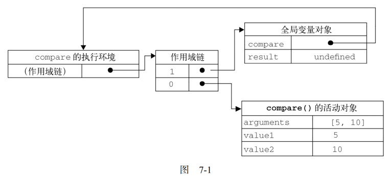
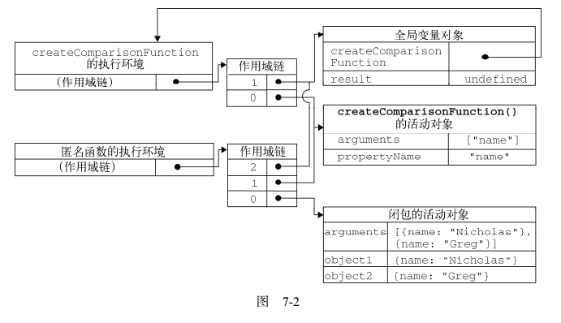

函数声明提升：在执行代码之前会读取函数声明。可以把函数声明放在调用它的语句后面

### 递归

 arguments.callee 是一个指向正在执行的函数的指针

```js
function factorial(num){
	if (num <= 1){
		return 1;
	} else {
		return num * arguments.callee(num-1);
	}
}
```

严格模式下，不能通过脚本访问 arguments.callee，访问这个属性会导致错误,可使用命名函数表达式来达成相同的结果

```js
var factorial = (function f(num){
  if (num <= 1){
    return 1;
  }else{
    return num*f(num-1);
  }
})
```

### 闭包

> **闭包**是指有权访问另一个函数作用域中的变量的函数

> 当某个函数倍调用时，会创建一个**执行环境**（execution context）及相应的**作用域链**。然后，使用arguments和其他命名参数的值来初始化函数的***活动对象***（activation object），但在作用域链中，外部函数的活动对象始终处于第二位，直至作用域链终点的全局执行环境

```js
function compear(value1,value2){
  if (value1 < value2){
    return -1;
  } else if (value1 > value2){
    return 1;
  } else {
    return 0;
  }
}
var result = compare(5,10)
```



> 后台的每个执行环境都有一个表示变量的对象—**变量对象**。全局环境的变量对象始终存在，而像compare()函数这样的局部环境的变量对象，则只在函数执行的过程中存在。

> 作用域链本质上是一个指向变量对象的指针列表，它只引用但不实际包含变量对象。

> 在函数中访问一个变量时，就会从作用域中搜索具有相应名字的变量。

> 在另一个函数内部定义的函数会将包含函数（即外部函数）的活动对象添加到它的作用域链中。

```js
function createComparisonFunction(propertyName) {
	return function(object1, object2){
		var value1 = object1[propertyName];
		var value2 = object2[propertyName];
      //匿名函数内部访问外部函数属性propertyName获取object1和object2这两个传入对象的propertyName属性值以便下面进行比较
		if (value1 < value2){
			return -1;
		} else if (value1 > value2){
			return 1;
		} else {
			return 0;
		}
	};
}
var compare = createComparisonFunction("name");
//传入要比较对象的属性名
var result = compare({ name: "Nicholas" }, { name: "Greg" });
//传入要比较的两个对象
compare = null;//解除对匿名函数的引用（以便释放内存）
```



* 闭包与变量

  作用域链的这种配置机制，导致闭包只能取得包含函数中任何变量的最后一个值(变量最终呈现的值)。

  ```js
  function createFunctions(){
  	var result = new Array();
  	for (var i=0; i < 10; i++){
  		result[i] = function(){
  			return i;
  		};
        //改进方法
        	//result[i] = function(num){
  		//	return function(){
  		//		return num;
  		//	};
  		//}(i);
  	}
  	return result;
  }
  ```

* 关于this对象

  > this对象是在运行时基于函数的执行环境绑定的：全局函数中，this等于window，而当函数被作为某个对象的方法调用时，this等于那个对象。

  > 匿名函数的执行环境具有全局性，因此闭包中使用this对象通常指向window(排除call和apply方法)

  ```js
  var name = "The Window";
  var object = {
  	name : "My Object",
  	getNameFunc : function(){
  		return function(){
  			return this.name;
  		};
  	}
  };
  alert(object.getNameFunc()()); //"The Window"（在非严格模式下）
  ```

  匿名函数没有取得其包含作用域（或外部作用域）的 this 对象?

  > 每个函数在被调用时都会自动取得两个特殊变量：this和arguments。内部函数在搜索这两个变量时，只会搜索到其活动对象为止，因此永远不可能直接访问外部函数中的这两个变量。

* 内存泄漏

### 模仿块级作用域

```js
(function(){
  //这里是块级作用域
})()
```

> 这种技术经常在全局作用域中被用在函数外部，从而限制向全局作用域中添加过多的变量和函数。一般来说，我们都应该尽量少向全局作用域中添加变量和函数。

### 私有变量

> 任何在函数中定义的变量，都可以认为是私有变量，因为不能在函数的外部访问这些变量。

> 私有变量包括函数的参数、局部变量和在函数内部定义的其他函数。

> **特权方法** 有权访问私有变量和私有函数的公有方法称为特权方法（privileged method）

**构造函数中定义特权方法**

```js
function MyObject(){
  //私有变量和私有函数
  var privateVariable = 10;
  function privateFunction(){
    return false;
  }
  //特权方法
  this.publicMethod = function(){
    privateVariable++;
    return privateFunction();
  }
}

function Person (name){
  this.getName = function (){
    return name;
  };
  this.setName = function (value){
    name=value;
  }
}
var person = new Person("suo");
alert(person.getname()); //"suo"
person.setName("chris");
alert(person.getName()); //"chris"
```

> 利用私有和特权成员，可隐藏哪些不应该被直接修改的数据。

> 构造函数模式缺点，实例方法不能共享

* 静态私有变量

  > 私有作用域中定义私有变量或函数，创建特权方法

  ```js
  (function(){
    //私有变量和私有函数
    var privateVariable = 10;
    function privateFunction(){
      return false;
    }
    //构造函数
    MyObject = function(){};
    //公有/特权方法
    MyObject.prototype.publicMethod = function(){
      privateVariable++;
      return privateFunction();
    }
  })()
  ```


* 模块模式

  > 模块模式（module pattern）则是为单列创建私有变量和特权方法，所谓单例（singleton）指只有一个实例的对象。

  > 模块模式通过为单例添加私有变量和特权方法能够使其得到增强，语法形式如下：

  ```js
  var singleton = function(){
    //私有变量和私有函数
    var privateVariable =10;
    function privateFunction(){
      return false;
    }
    //特权方法和属性
    return{
      publicProperty:true,
      publicMethod : function(){
        privateVariable++;
        return privateFunction();
      }
    }
  }();
  ```
  > 在需要对单例进行某些初始化，同时又需要维护其私有变量时非常有用，例如：

  ```js
  var application = function(){
    //私有变量和函数
    var components = new Array();
    //初始化
    components.push(new BaseComponent());
    //公共
    return {
      getComponentCount : function(){
        return components.length;
      },
      registerComponent : function(component){
        if(typeof component == "object"){
          components.push(component);
        }
      }
    }
  }();
  ```

  > 如果必须创建一个对象并以某些数据对其进行初始化，同时还要公开一些能够访问这些私有数据的方法，那么就可以使用模块模式。

* 增强模块模式

  > 在返回对象之前加入对其增强的代码。这种增强的模块模式适合那些单例必须是某种类型的实例，同时还必须添加某些属性和（或）方法对其加以增强的情况。

  ```js
  var singleton = function(){
    //私有变量和私有函数
    var privateVariable = 10
    function privateFunction(){
      return false;
    }
    //创建对象
    var object = new CustomType();
    //添加特权／公有属性和方法
    object.publicMethod = function(){
      privateVariable++;
      return privateFunction()
    }
    //返回这个对象
    return object;
  }();
  ```

  ```js
  function BaseComponent(){
              }
  function OtherComponent(){
              }
  var appliction = function(){
    //私有变量和函数
    var components = new Array();
    //初始化
    components.push(new BaseComponent());
    //创建application的一个局部副本
    var app = new BaseComponent();
    //公共接口
    app.getComponentCount = function(){
      return components.length;
    };
    app.registerComponent = function(component){
      if (typeof component == "object"){
        components.push(component);
      }
    };
    //返回这个副本
    return app;
  }();
  alert(application instanceof BaseComponent);
  application.registerComponent(new OtherComponent());
  alert(application.getComponentCount());  //2
  ```

  ​

