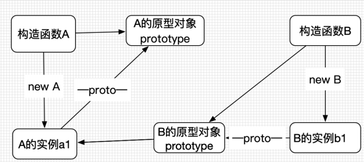

# 继承

回顾：

js创建对象的几中模式，工厂模式，构造函数模式，原型模式，组合模式等

所有的函数上都有一个特殊的属性叫做 prototype，这个prototype指向的是一个对象这个对象我们称之为原型对象。而在这个原型对象上默认只有一个属性叫constructor，这个constructor又指向了这个构造函数。形成一个闭环。

所有的对象上都有个隐藏属性叫做proto ，这个proto正常是访问不到的，在现在浏览器上可以使用`__proto__` 访问。这个proto指向了当前这个对象他所对应的构造函数所对应的原型对象。当你去访问一个对象上的属性的时候，首先会去看这个对象上有没有这个属性，有这个属性就直接调用或访问，没有的话解释器就会顺着proto找到对应的原型对象看看原型对象上有没有这个属性。如果有就直接调用原型对象上的属性，如果原型对象上没有，那么原型对象本身也是一个对象它的上面也有一个proto的隐藏属性，这时解释器会顺着这个proto接着往它上一层找到它所对应的原型对象，依次的去往上查找。我们也把每一个对象上所对应的proto链接成的这一条线路称之为**原型链**。我们去访问对象上的每一个属性的时候，都会顺着原型链依次往上去访问，原型链的最后指向一个null这么一个特殊的东西。

如果设置的话，比如给对象添加一个属性或者给一个属性赋值，这个时候会在当前这个对象上直接添加属性或直接把当前对象上的属性改掉。

------

面向对象

在整个语言当中会有很多的类，类和类之间存在继承关系。

面向过程 

-----

js本身是通过函数累加来实现的，也被称作面向过程的语言。 不存在面向对象的思想，只不过可以模拟出来。 

**继承** 马里奥游戏举例

##原型链继承

假设有两个构造函数A和B，让B的实例可以使用A的属性或者方法怎么做？

当你使用 new B去创建B的实例的时候，如果你去使用这个实例上的属性和方法，这个时候会去看这个实例上有没有这个属性和方法。如果没有会到这个实例对应的原型对象上继续去找。那么现在的任务是要让它没有的时候去A上找，此时我们可以让B这个构造函数所对应的原型对象去指向A的实例如下：



```js
B.prototype = new A()
// 让子类的原型对象指向父类的实例
```

接下来我们去创建B的实例的时候：当我们去访问B的实例b1上的属性和方法的时候，首先去看实例b1上有没有这个属性和方法，如果没有就去B这个构造函数的原型对象上找，这时B的构造函数原型对象已经变成A的实例了，相当于去A的实例上去找，A的实例上也没有这个时候怎么办 ,会顺着A的实例对象上的--proto—去找A的原型对象所对应的属性和方法。

**优点：**

1. 使用简单。

2. 当我们使用这行代码后接着在b的prototype上增加属性和方法的时候子类都可以访问的到。在父类的原型对象上增加属性和方法不会影响到继承对象A

   > 为什么不直接让`B.prototype = A.prototype` ？
   >
   > 这样给B.prototype增加属性和方法的时候会破坏A 的原型对象。

**缺点：**

1. 当你给给子类增加属性和方法的过程，必须写在 B.prototype = new A() 之后。否则会被覆盖掉。
2. 使用原型链继承时，无法实现多继承（骡子继承驴和马）。
3. 所有的属性都是共享的。（原型对象上一般都是方法）
4. 没有办法传递参数。（重要缺陷）

##借用构造函数模式

在子类型构造函数的内部调用超类型构造函数。别忘了，函数只不过是在特定环境中执行代码的对象因此通过使用 apply()和 call()方法也可以在（将来）新创建的对象上执行构造函数。

核心思想：在子类的构造函数中去使用call或着apply把整个父类的构造函数重新的运行一遍。

```js
function B(obj){
    A.apply(this,[argement]) //A.call(this,obj) 
}
// 当我们在B的构造函数中重新运行一遍A的构造函数，相当于把A重写了一遍。
```

执行这操作后，每次去创建B的实例对象b1 时相当于把A执行了一遍，这时就实现了继承。B中设置name这时Age相当于在b1中都执行了一遍。

**new 操作符执行的过程**：

1. 创建一个新对象；
2. 将构造函数的作用域赋给新对象（因此 this 就指向了这个新对象）
3. 执行构造函数中的代码（为这个新对象添加属性）
4. 返回新对象。

优点：

1. 可以实现多继承。（骡子可以继承马和驴 ）
2. 解决了共享的问题。（每次去new B 的时候都是重新的执行了A相当于创建了新的对象）
3. 可以传递参数。（在子类的构造函数当中传递的参数会接着在父类的构造函数中重新的运行一遍。）

缺点：

1. 借用构造函数思想是，把上面的函数在下面重新运行一遍。new B创建的实例只是子类B的实例不是父类A的实例。因为在子类B中只是把父类A运行了一遍，跟把父类的代码完全拷贝过来是完全一样的。不是亲生的。
2. 只能继承构造函数中的属性和方法，不能继承原型中的属性和方法。 
3. 所有的属性都是在构造函数当中运行的，没法复用。

## 组合继承(伪经典继承)

 在子类的构造函数中使用call()或apply()去让父类的构造函数重新运行一遍，通过这个方法我们可以传参数。接下来我们使用原型模式，让子类的原型去指向父类的实例。

```js
function B(obj){
    A.apply(this,[arguments]) //A.call(this,obj) 
}
B.prototype = new A()
B.prototype.constructor = B;
```

> 组合式继承结合了原型继承和借用构造函数继承两种方式的优点，避免了他们两个的缺点。可以实现多继承，可以传参，与此同时 instanceof  isPrototypeOf()也都指向了对应正确的东西。

缺点：

1. 父类构造函数A在这种组合式的继承下被调用了两次。第一次是在子类的构造函数B中使用call/apply的时候，这时相当于把函数A运行了一遍只不过把this改了。第二次在设置子类B的原型等于父类A的实例的时候。new 相当于创建一个对象把把this指向这个新对象，然后运行构造函数后返回这个对象。

   * 这样当父类A构造函数比较大的时候，**影响性能**

2. 同名覆盖

   ```js
   function A(){
      this.name=123
   }
   function B(){
       A.apply(this,[arguments])
   }
   B.prototype = new A()
   var b1 = new B
   // b1上有个name属性，B的原型上也有一个name属性（B的原型是A的实例对象）
   ```

    在构造函数中设置的属性和方法在实例中存在了一份，在实例对应的原型对象中又存在了一份，只不过发生了同名覆盖，原型中的访问不到了。同样的东西存在了两份**占用了多余的内存**。

##原型式继承

前面的三种方式的继承创建对象都是使用new操作符创建的。

创建对象有三种方式：

1. 对象字面量 {}
2. new 操作符
3. Object.creat()

字符字面量创建的对象如何实现B继承A？

```js
var A = {}
var B = {}
//思路
B.--proto-- = A
// 借助一个空函数
var F=function(){}
F.prototype=A
B = nwe F // 此时 B.--proto-- = F.prototype 间接的B就继承了A
/**过程封装后**/
function object(o){
    function F(){}
    F.prototype = o
    return new F()
}
// B继承A
B = object(A) 
```

跟原型链继承相比，原型链继承继承的是一个构造函数。原型继承继承的是一个普通的对象。

ECMAScript 5 通过新增 **Object.create()**方法规范化了原型式继承。

第一个参数，你要继承的对象，实现过程跟原型继承一样，创建一个空函数让它prototype等于你要继承的那个普通对象。然后使用new操作符new一个新的实例对象返回

第二个参数，为新对象定义额外属性的对象。 可以配置属性的特殊状态，属性是否可写是否可以枚举（了解） 

> 低版本浏览器可以为Object自定义一个create()

缺点，看起来不像继承，像是创建函数

## 寄生式继承

跟原型式继承是一个东西，只不过是使用一个函数把原型式继承包裹起来，然后在包裹起来的过程当中有为创建出来的新的对象增加了一些属性和方法，也叫对象增强。

```js
function object(o){
    function F(){}
    F.prototype = o
    return new F()
}
function createAnother(original){
    var clone = object(original); //通过调用函数创建一个新对象
    clone.sayHi = function(){ //以某种方式来增强这个对象
    	alert("hi");
    };
    return clone; //返回这个对象
}
```

目的是让它看起来更像是继承，它不是一种特殊的手段，而是一种写的方式。

**原型式继承和寄生式继承是让一个对象直接继承另外一个对象而不是继承一个构造函数**

## 完美继承（组合寄生式继承）

把寄生式继承和组合模式合到了一起。 目的是解决组合模式的两个问题。

1. 构造函数被运行了两次
2. 构造函数中的实例和属性同时存在于实例和原型当中。

组合式构造函数运行的两个地方：

```js
function B(obj){
    A.apply(this,[arguments]) // 第二个地方 为了传递参数这个不能省略
}
B.prototype = new A() // 第一个地方 想办法修改这里
// new A() 目的是为了拿到原型对象的副本，可以用寄生模式去拿
B.prototype.--proto-- = A.prototype
// --proto-- 不能用使用寄生模式
B.prototype.constructor = B;
```


```js
var p = object(A.prototype);//继承于父类原型对象的对象
p.constructor = B
B.prototype=p
// 此时B的原型对象当中就没有构造函数A中设置的属性和方法了，而且A这个构造函数也只需运行一次，即使用call/apply的时候。
```

完整代码：

```js
function A(){}
function object(o){
    function F(){}
    F.prototype = o
    return new F()
}
function inheritPrototype(B,A){
    var p = object(A.prototype)
    p.constructor = B
	B.prototype=p
}
function B (){
    A.apply(this,[arguments])
}
inheritPrototype(B,A)
```

**总结：**

1. 原型链式继承

   让子类的原型对象指向父类的实例对象。这个时候当你去创建一个子类的实例的时候，如果去调用它的属性和方法，就会先在子类的实例中找，没找到就会到它的原型对象中去找。原型对象是父类的一个实例，相当于到父类的实例中找，如果父类的实例中还没有找到就到父类的原型对象中去找。

2. 借用构造函数模式继承

   让父类的构造函数在子类中重新运行一遍，使用call/apply()。整个过程跟把父类构造函数复制过来重新运行一遍一样。

3. 组合继承（伪经典继承）

   结合了原型链式继承和借用构造函数模式继承。但有两个小问题：

   1. 父类函数被调用了两次
   2. 属性和方法在实例和原型当中各存在了一份，多占用了一点内存

4. 原型式继承

   继承字符字面量所创建的对象就是一个普通的对象。核心思想是使用原型链做中间一个跳板，使用这个跳板来实现一个`B.__proto__=A` ES5中也针对这种原型式继承增加了一个新的方法叫 **Object.create()**方法规范化了原型式继承。也是创建对象的第三种方法

5. 寄生式继承

   为了让原型式继承看起来更像继承。

   把原型式继承用一个函数包裹起来，让它看起来像是继承。

6. 组合寄生式继承（完美继承/经典继承）

   把组合继承和寄生式继承放在一起。

   理论上是没有任何缺点的，只不过写起来麻烦点。他要解决的问题是构造函数被运行两次的问题。解决这个问题的时候，因为我们要传参，所以call/apply是不能省略的。我们只能把目标定在 ` B.prototype=new A` 而我们使用这行代码唯一的目的就是像让`B.prototype.__proto__`去等于`A.ptototype` 解决这个问题就要去使用寄生式继承这个方法。我们创建一个中间跳转对象让这个中间跳转对象去继承于A.prototyper 然后我们把这个跳转对象的constructor对象指向B，接着把这个跳转对象指向B的原型。来实现这个组合寄生式继承。

**继承唯一的目的就是让一个对象拥有另外一个对象的属性和方法。**

最简单方式直接把对象的属性和方法拷一份过来就得了。

**浅克隆**：最简单的继承把A的属性拷到B

```js
var A ={} //十个属性对应的都是原始类型
var B
for(var i in A) {
    B[i]=A[i]
}
```

当A中的属性对用不是原始类型是一个对象的话？

B拷过来属性可能是个引用。

**深克隆**

当我们去拷贝一个属性的时候首先去判断一下这个属性所对应的值的数据类型。如果是一个原始类型直接拷过来。如果不是原始类型说明是一个对象，这时我们要再次执行一个for循环，把对象里面所有的值再拷过来。这时就涉及到递归。