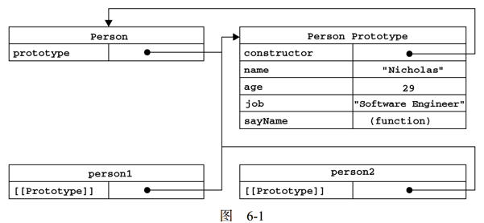
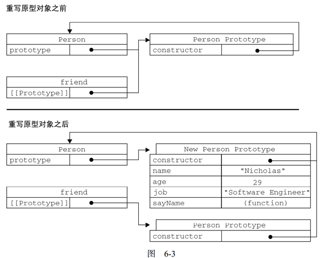

# 面向对象的程序设计

##理解对象

了解

##创建对象

- 创建单个对象

  - 对象字面量
  - new 操作符
  - Object.create()  ES5方法

  缺点：创建多个对象时会产生大量的重复代码。

- 创建多个对象

------

###工厂模式

把创建对象的过程用一个函数包裹起来，每次需要创建对象时只需运行这个函数就行。

```js
function createPerson(name, age, job){
    var o = new Object();
    o.name = name;
    o.age = age;
    o.job = job;
    o.sayName = function(){
    	alert(this.name);
    };
    return o;
}
var person1 = createPerson("Nicholas", 29, "Software Engineer");
var person2 = createPerson("Greg", 27, "Doctor");
```

缺点：创建出来的对象只是一个普通的对象，**无法区别对象的类型**。

------

###构造函数模式

**this的指向分类：** `this`就是函数运行时所在的环境对象。

1. 纯函数的调用

   创建一个函数，直接在函数中调用this，this指向全局作用域。作为纯函数的调用this指向全局作用域。

2. 作为对象方法的调用

   作为对象的方法或属性调用的时候，this指向这个对象

3. 作为构造函数

   this在构造函数中调用的话，this指向的是创建出来的新对象。

4. 强制指向一个对象，call/apply

   第一个参数是this要指向的对象，后面的aplly用的是数组，call用的逗号分隔的参数。

```js
function Person(name, age, job){
    this.name = name;
    this.age = age;
    this.job = job;
    this.sayName = function(){
    	alert(this.name);
    };
}
var person1 = new Person("Nicholas", 29, "Software Engineer");
var person2 = new Person("Greg", 27, "Doctor");
// 判断构造函数对象
person1.constructor.name // Person
```

**new 操作符执行的过程**：

1. 创建一个新对象；
2. 将构造函数的作用域赋给新对象（因此 this 就指向了这个新对象）
3. 执行构造函数中的代码（为这个新对象添加属性）
4. 返回新对象。

**跟工厂模式的不同：**

1. 没有显式的创建对象

2. 将所有的方法和属性赋值给了this

3. 没有显式的return语句

4. > 函数名第一个字母大写，表示它是一个构造函数。

**构造函数如果解决对象无法识别问题？**

 **constructor**（构造函数）属性

对象都有constructor属性，它是一个指针，指向当前这个对象的构造函数。

工厂函数的constructor属性指向的都是Object。构造函数模式创建的对象，constructor属性指向了它的构造函数。所以可以通过对象的constructor属性知道它是那个构造函数创建的。

**instanceof** 操作符

检测对象类型

```js
person1 instanceof Object //trure
person1 instanceof Person //trure
```

**将构造函数当作普通函数使用：**

> 任何函数，只要通过 new 操作符来调用，那它就可以作为构造函数；而任何函数，如果不通过 new 操作符来调用，那它跟普通函数也不会有什么两样。

```js
// 当作构造函数使用,this指向新创建的person对象
var person = new Person("Nicholas", 29, "Software Engineer");
person.sayName(); //"Nicholas"
// 作为普通函数调用, this指向window对象
Person("Greg", 27, "Doctor"); // 添加到 window
window.sayName(); //"Greg"
// 在另一个对象的作用域中调用, this强制指向o这个对象
var o = new Object();
Person.call(o, "Kristen", 25, "Nurse");
// 直接运行Person函数，把所有的this都变成了o
o.sayName(); //"Kristen
```

**构造函数的问题：**

构造函数创建出来的对象，它上面的每一个方法每一个属性，都要在创建出来的对象上重新实例化一遍。

> 比如sayName()方法功能相同但每次实例化都要重新创建一个，方法也是对象的一种，它会在内存中开辟一个新空间。

可以把函数定义转移到构造函数外部来解决问题，构造函数中只做引用。

```js
function Person(name, age, job){
    this.name = name;
    this.age = age;
    this.job = job;
    this.sayName = sayName;
}
function sayName(){
	alert(this.name);
}
var person1 = new Person("Nicholas", 29, "Software Engineer");
var person2 = new Person("Greg", 27, "Doctor");
```

但新问题，容易造成全局命名空间污染。因此引出了原形模式。

------

###原型模式

####理解原型

**prototype（原型）属性**

​	每个函数都有一个 prototype（原型）属性，这个属性是一个指针，指向一个对象，而这个对象的用途是包含可以由特定类型的所有实例共享的属性和方法。

​	对于任何一个函数而言它都有一个prototype（原型）属性。这个prototype所对应的是一个对象，我们把prototype属性所对应的对象称作函数的**原形对象**。每一个对象都有一个特殊的属性constructor指向它的构造函数。而原型对象他作为对象也必然有constructor属性。原型对象的constructor属性就直接指向了当前函数。

Person函数的prototype属性指向一个原型对象，原型对象的constructor属性又指向了Person函数，形成了一个闭环。

```js
function Person(){
}
Person.prototype.name = "Nicholas";
Person.prototype.age = 29;
Person.prototype.job = "Software Engineer";
Person.prototype.sayName = function(){
	alert(this.name);
};
var person1 = new Person();
person1.sayName(); //"Nicholas"
var person2 = new Person();
person2.sayName(); //"Nicholas"
alert(person1.sayName == person2.sayName); //true
```

**原型模式是如何做到创建出来的对象中的方法是同一个的？**

每一个对象内部都有一个特殊指针指向他的构造函数的原型对象。



如上图person1中有一个[[Prototype]] 属性，它指向的是Person的原型对象。

当我们去**访问**person1中的某一个属性的时候，解释器首先会去person1这个对象上去查找有没有你要的那个属性。有就返回，没有就顺着[[Prototype]] 属性找它对应的原型对象上的属性，即Person Prototype。如果在原型对象中找到了就直接返回回来，如果没找到就方法undefined。

当我们去**设置**一个属性和方法时，解释器不会顺着原型链查找。它会直接看当前对象中有没有这个属性或者方法。有就直接赋值没有就直接在当前对象上去创建这个属性或方法。

解释器在查找和创建属性的操作就会出现一个问题。**同名屏蔽** 即在用原型模式创建的对象上设置属性和方法时会屏蔽原型链上同名的属性和方法。

可以使用dele操作符删除对象上的属性和方法。

**为什么所有的对象都有toString()和valueOf()方法？**

toString()和valueOf()这两个方法是存在于Object对象的原型对象上面的。

另外三个方法

* isPrototypeOf()方法

  检测一个对象是否是参数的原型。

  ```js
   Person.prototype.isPrototypeOf(person1) //true
  ```

*  hasOwnProperty()

  检测一个属性是存在于实例中，还是存在于原型中。

  ```js
  person1.hasOwnProperty("name") //false
  ```

* propertyIsEnumerable()

  查找出来的属性是否是个可枚举的属性。

  ```js
  person1.propertyIsEnumerable("name") //true
  ```

 **获取对象的原型**

* Object.getPrototypeOf()  (ES5)

  可以方便地取得一个对象的原型

  ```js
  Object.getPrototypeOf(person1) == Person.prototype //true
  Object.getPrototypeOf(person1).name //"Nicholas
  ```

####原型与in操作符

 **for-in 循环**是对一个对象不断的枚举，枚举对象上的所有属性。

for-in循环除了查找当前对象上的属性还顺着原型链，去查找原型对象上的属性。然后把所有可枚举的属性全部列出来。

**in 操作符** 二元操作符，可以单数使用in操作符去判断某一个属性是否是某一个对象上的属性。

```js
"name" in person1 //true
```

in这个操作符也会顺着原型链去查找原型上的属性

**如何只列举当前对象上的自有属性？**

1. 先通过for-in循环对象上的所有属性，然后通过 `person1.hasOwnProperty("name")` 来判断是当前对象上的属性

2. Object.getOwnPropertyNames(person1)  （ES5）

   获取对象上所有的自有属性和方法。

**获取对象上所有可枚举的实例属性：** ？存疑

1. for-in循环
2. Object.keys(person1)

**查找非自有属性即获取原型上的属性：**

1. 自有属性和所有属性去重
2. 用Object.getPrototypeOf(person1) 找到原型对象，通过Object.getOwnPropertyNames(person1) 列出原型对象上的属性。

**哪些可枚举，哪些不可枚举：**

* 平时开发创建出来的对象上的所有属性和方法都是可枚举的，除非特殊处理，默认都是可枚举。

* Object原型当中它所有方法都是不可枚举的。

  valueOf()  toString()  isPrototypeOf()  hasOwnProperty()  propertyIsEnumerable()

  每一个对象上都有的一个特殊属性 constructor ES3下是可枚举，ES5下是不可枚举的。

  IE8 下创建对象的方法名字跟Object上不可枚举的方法重名后你的这个方法也会变成不可枚举的。toString() 等

#### 更简单的原型语法

用一个包含所有属性和方法的对象字面量来重写整个原型对象

```js
function Person(){
}
Person.prototype = {
    name : "Nicholas",
    age : 29,
    job: "Software Engineer",
    sayName : function () {
    	alert(this.name);
    }
};
```

问题： constructor 属性不再指向 Person 了

```js
function Person(){
}
Person.prototype = {
    constructor : Person, // 解决constructor指向问题
    name : "Nicholas",
    age : 29,
    job: "Software Engineer",
    sayName : function () {
    	alert(this.name);
    }
};
```

问题：constructor 属性应该是不可枚举的

```js
//重设构造函数，只适用于 ECMAScript 5 兼容的浏览器
Object.defineProperty(Person.prototype, "constructor", {
    enumerable: false,
    value: Person
});
```

#### 原型的动态性

我们使用new操作符去创建一个实例，而且当我们去查找实例上的某一个属性的时候，这个查找的过程是基于原型链的搜索，这个搜索只是在你去访问属性的那一瞬间产生的一个行为。这个行为和实例初始化的位置是没有任何关系的。

```js
var friend = new Person();
Person.prototype.sayHi = function(){
	alert("hi");
};
friend.sayHi(); //"hi"（没有问题！）
```

如果是重写原型对象就会有问题：

```js
function Person(){
}
var friend = new Person();
Person.prototype = {
    constructor: Person,
    name : "Nicholas",
    age : 29,
    job : "Software Engineer",
    sayName : function () {
    	alert(this.name);
    }
};
friend.sayName(); //error
```



重写原型后，之前实例化的对象指向的还是老的原型对象。只是改变了构造函数的原型指向新原型。

**建议：**

使用原型模式步骤：

1. 创建构造函数
2. 给构造函数的原型对象添加属性和方法
3. 实例化对象
4. 调用对象属性和方法

不建议用对象字面量方式给构造函数添加属性和方法，原型添加属性和方法最后使用：Person.prototype.name = "Nicholas";

**理解常用对象方法原理：**

Boolean，String，Number，Array，Date，function ，Object，RegExp

都有自己的属性和方法，这些方法都是通过原型对象来实现的。可以通过给原型对象上增加一些新的方法来实现新的功能。比如字符串可以通过给原型对象增加新方法让ES3支持ES5的功能。

**总结：**

原型模式解决了构造函数模式占有资源的问题，原型模式所存在的问题和构造函数正好相反，构造函数模式是新生成的实例上面都有独立的方法和属性， 而原型模式是所有的实例都公用相同的实例和方法。实例1修改值时肯会影响其他实例的值。为了解决这个问题就需要组合使用两种模式，叫组合模式。

###组合使用构造函数和原型模式

可变的属性放到构造函数中，公共的方法放到原型对象中。

```js
function Person(name, age, job){
this.name = name;
this.age = age;
this.job = job;
this.friends = ["Shelby", "Court"];
}
Person.prototype = {
    constructor : Person,
    sayName : function(){
    	alert(this.name);
    }
}
var person1 = new Person("Nicholas", 29, "Software Engineer");
var person2 = new Person("Greg", 27, "Doctor");
person1.friends.push("Van");
alert(person1.friends); //"Shelby,Count,Van"
alert(person2.friends); //"Shelby,Count"
alert(person1.friends === person2.friends); //false
alert(person1.sayName === person2.sayName); //true
```

###动态原型模式 *

通过检查某个应该存在的方法是否有效，来决定是否需要初始化原型。

```js
function Person(name, age, job){
    //属性
    this.name = name;
    this.age = age;
    this.job = job;
    //方法
    if (typeof this.sayName != "function"){
        Person.prototype.sayName = function(){
        	alert(this.name);
        };
    }
}
var friend = new Person("Nicholas", 29, "Software Engineer");
friend.sayName();
```

###寄生构造函数模式 *

工厂模式前面使用new操作符。

基本思想是创建一个函数，该函数的作用仅仅是封装创建对象的代码，然后再返回新创建的对象

```js
function Person(name, age, job){
    var o = new Object();
    o.name = name;
    o.age = age;
    o.job = job;
    o.sayName = function(){
    	alert(this.name);
    };
    return o;
}
var friend = new Person("Nicholas", 29, "Software Engineer");
friend.sayName(); //"Nicholas"
```

**new 操作符执行的过程**： 使用new 相当于在函数的最上面创建一个新对象，函数的最下面返回一个新对象，把函数当中所有的this都改成新的对象。工厂模式使用new时最后会有两个return ，new所对应的return时执行不到的所以会返回对应的对象。

创造一个和本地对象类似的对象时可能会用到。

###稳妥构造函数模式 

不使用this也不使用new的一种方式

## 总结：

创建单个对象的方式不适合大量使用，引出了工厂模式，

**工厂模式**，创建的对象不能区分对象类型，引出了构造函数模式，

**构造函数模式**，可以通过实例对象的constructor属性拿到对象的构造函数来区分对象类型。构造函数模式所有实例化出来的对象上的属性和方法都是完全独立的，对于属性没什么问题对于方法来说相同的方法重复创建浪费内存空间，引出了原型模式

**原型模式**，所有的函数都有一个prototype属性指向对象的原型，这个原型称做原型对象。对象都有constructor属性，原型对象的constructor属性又指向了当前的函数形成了闭环。当我们每次去**访问**一个对象的属性的时候，解释器首先会看下当前对象上是否有这个属性，如果没有顺着原型链找一下上一层的原型对象有没有，如果还会没有再顺着原型链再往上一层去查找，一层一层的查找知道查找到Object对象为止。当我们给一个对象**设置**属性或方法时，解释器不会顺着原型链查找，就直接看一下对象上有没有，有的话直接修改，没有的话直接添加一个属性或方法。

如何获取一个实例上的自有属性：

1. 使用for-in循环获取所有的属性，然后通过hasOwnProperty() 判断是不是自有属性（ES3）

2. （ES5）直接使用 Object.getOwnPropertyNames(person1)

   ```js
   person1.hasOwnProperty("age") // true
   Object.getOwnPropertyNames(person1) 
   // ["name", "age", "job", "sayName"]
   ```

获取所有的属性：

1. （ES5）直接Object.keys() 
2. （ES3）for-in循环

获取原型上的属性：

1. （ES5） 使用Object.getPrototypeOf(person1) 访问对象的原型，然后Object.getOwnPropertyNames() 把原型上的属性拿出来。

使用更简单的原型语法：（不建议）

使用字面量方式定义原型对象。直接把一个对象赋值给构造函数的prototype属性。问题一，原型对象中的constructor属性指向不对，需要给constructor属性重做一下指向。问题二 ，指向后constructor属性从一个不可枚举的属性变成了可枚举的属性需要使用ES5的方法修改成不可枚举属性。问题三，是通过原型的动态性提出来的，如果你使用了直接给prototype赋一个对象的方法可能会切断整个实例和对象之间的联系，这具体要看实例在什么地方进行实例化。

当你需要对一个构造函数的原型进行属性和方法的添加**最好**还是使用 Person.prototype.name="" 的形式。

> Boolean，String，Number，Array，Date，function ，Object，RegExp

js中的8种常用对象上的方法都是在原型对象上添加的方法。如果想增加新的方法的话可以直接修改原型对象上的值，或者直接在原型对象上去增加方法。

原型模式问题：

原型模式问题跟构造函数模式的问题正好相反，构造函数模式是吧所有的属性和方法都做成独立的，原型模式是吧所有的属性和方法都做成可共享。因此就引出了组合模式。

**组合模式**，一般情况下会把常变的东西做成构造函数如属性。把不变的东西做到原型里如方法。 针对具体问题具体分析

