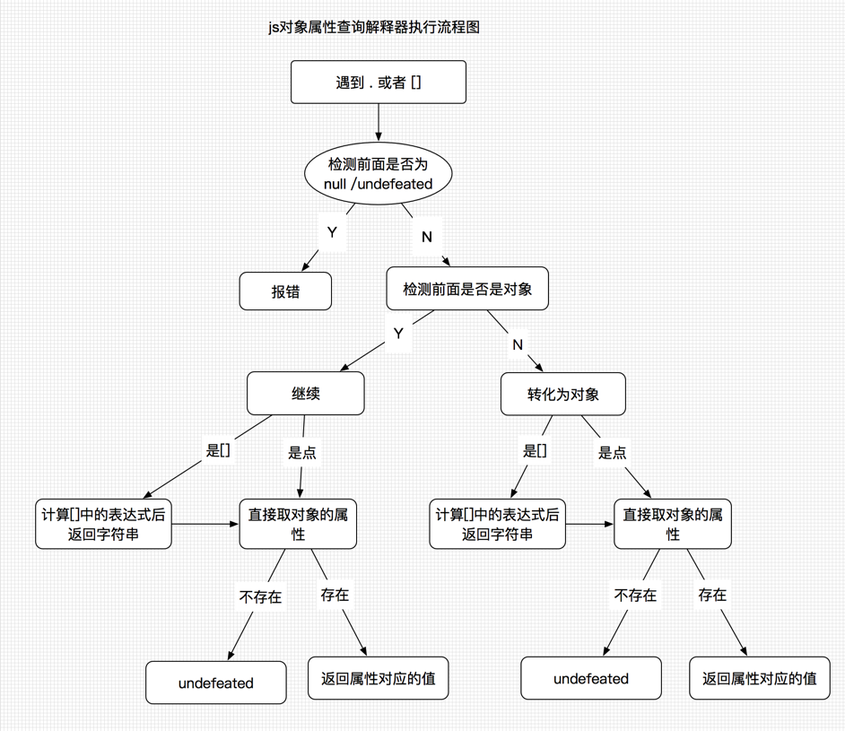

## 数据类型

计算机的本质是计算，计算的本质是对值进行操作，值就是数据。数据类型就是对值进行分类。常规分类：数字，文本，真假

ECMAScript 中有 5 种简单数据类型（也称为基本数据类型）：

Boolean、Number、String、Undefined、Null

 1 种复杂数据类型——Object。

Object 本质上是由一组无序的名值对组成的。除了基础数据类型其他都是对象。

仓老师：名字(string)，年龄(number)，是否知名(boolean)， 生日(undefined/null)，三维(object)，作品(array)

* 只有对象才有方法

  **对象所具有的功能（如:笔能写字）在js中叫做方法。每一个对象都有自己的方法。理论上说只有对象才有方法。基础类型没有方法。**

  ```js
  var a ="abcd"
  a.len=4 
  a.len //undefined
  // 给a设置属性时js解释器会把a转换为对象调用对象的方法，而且这种方法在过程结束后就自动关闭。涉及到的临时变量都会清除掉。
  a.toUpperCase() //"ABCD"
  a //"abcd" 
  ```

* 数据类型的可变性

  基础数据类型不可变

  复杂数据类型Object可改变

  js中基础数据类型比较时是对值进行比较，对象的比较时对引用进行比较。任何两个独立的对象都不相等。


* ECMAScript 数据类型具有**动态性**：

  动态性是指js在定义变量时，只是给变量赋值这么简单，并没有确定变量的数据类型。只有在参与计算时才会动态的去取它所对应的数据类型。

### typeof操作符

typeof操作符用来检测给定变量的数据类型，typeof返回的都是字符串。typeof不是函数

```js
var a=true
var b= true
alert(typeof a==b) //返回true 相当于"boolean"==b
alert(typeof (a==b)) //返回 "boolean"
```

### 基本数据类型

- Underfined

  > 使用 var 声明变量但未对其加以初始化

  程序内部先定义一个undefined 提高性能，防止到window对象上找

- Null

  > null 值表示一个空对象指针。只要 意在 保存 对象 的 变量 还没有 真正 保存 对象， 就应 该 明确 地 让 该 变量 保存 null 值。

  **相同点：**

  1. 都只有一个值
  2. 参与判断都返回false
  3. 都没有方法

  **不同点：**

  1. null 是关键字，undefined不是关键字
  2. null 本质是一个空对象，undefined是win对象的属性，虽然翻译叫未定义，但undefined是个已经定义的属性，它的值叫做未定义undefined。函数中定义undefined提高性能。
  3. typeof查看类型时返回不同。undefined返回"undefined"，null返回"object"
  4. 试图传化为数字时，undefined 返回NaN，null返回0

  **用法：**

  1. 声明变量而且必须赋值时，或者创建一个对象要给对象的某个属性赋空值时，可以使用null
  2. 检测某个值是否存在时用 === undefined ，通常用于判断函数中的某个参数是否存在时。
  3. 检测某个值是否存在或者是否为空时用 == null

  **建议：**

  1. 不要在赋值时用undefined，用null
  2. 判断值是否存在或是否为空时，== null
  3. 明确知道返回的值时用 === null 或 === undefined

- Boolean

  转型函数Boolean()

  js中所有的数据类型都可以转换为布尔类型。

  可以被转换为false的6个数据类型：**undefined**、**null**、 **0**、 **-0**、 **NaN** 、**' '**。

   转化为布尔类型的简写方法 ：!!

  > 空对象{} 和空数组[] 转化为布尔值都是true，因对象转化为布尔值都是true

- Number

  数字可分为3类：常规的数字，Infinity无穷，NaN

  * 整数：正常使用

  ```js
  var octalNum1 = 070 //8进制 0开头（0~7）
  var hexNum1 = 0xA1f //16进制度 0x开头（0～9及A～F）
  var floatNum=3.125e7 //e表示法，等于31250000
  0.00000000000000003 //3e-17
  ```

  > NaN（Not a Number）是一个特殊的数值，这个数值用于表示一个本来要返回数值的操作数未返回数值的情况

  * 浮点数

    所谓浮点数值，就是该数值中必须包含一个小数点，并且小数点后面必须至少有一位数字。

    浮点数值需要的内存空间是保存整数值的两倍。

    永远不要拿两个小数进行比较。

    ```js
    0.1 + 0.2 // 0.30000000000000004
    // 1.转化为整数计算，然后再转化为浮点数
    ((0.1*10) + (0.2*10)) /10  //0.3
    // 2.保留特定位数
    (0.1 + 0.2).toFixed(2) // 0.30
    ```

    如果涉及到小数的乘法和加法的时候一定好保持**书写的顺序一致**

    > 现打折再相加还是先相加后打折的问题

  * 数值范围

    ```js
    1/0 // Infinity 无穷大
    0/0 //NaN
    ```

  - NaN

    NaN，即非数值（Not a Number）是一个特殊的数值，这个数值用于表示一个本来要返回数值的操作数未返回数值的情况。

    NaN 是一个数字，但它不等于任何数字

    ```js
    NaN == NaN //false NaN不等于NaN
    ```

    **isNaN()** 函数判断被传入的数据是否能被转换为数字。不能转化为 数字的返回ture。

  - 数值转换

    - Number() 可以把任何类型的数据类型转化为数字，

      返回两种类型 1.数字 2.NaN

    - parseInt() 和parseFloat() 用于处理字符串，保持第二个参数为10，按十进制解析

  > `Number() `可以用于任何数据类型,转换的是整个值
  >
  > `parseInt() `从第一个字符（位置0）开始解析忽略字符串前面的空格，第一个非空格字符不是数字或负号，返回NaN。如果第一个字符是数字，会继续解析直到解析完所有后续字符串或者遇到了一个非数字字符。 
  >
  > parseInt()能够识别出各种整数格式。字符串以"0"开头且后跟数字字符，则会将其当作一个八进制数来解析。以“0x”开头后跟数字字符会被当做一个十六进制数来解析。所以最好明确 **指定基数**
  >
  > `parseFloat() `也是从第一个字符（位置0）开始解析每一个字符。也是一直解析到字符串末尾，或者解析到遇见一个无效的浮点数字字符为止。字符串中第一个小数点是有效的，而第二个小数点就是无效的了，它后面的字符串将被忽略。只解析十进制

- String

  字符串的本质是Ucode编码

  字符串建议使用单引号，如果单引号的字符串中有单引号 使用 \' 字符字面量

  字符字面量可以出现在字符串中的任意位置，而且也将被作为一个字符来解析

  ```js
  \n  //换行 
  \u03a3 //表示的一个Unicode字符 希腊字符Σ
  alert(text.length) // length字符串长度
  ```

  > ECMAScript中的字符串是不可变的，字符串一旦创建，他们的值就不能改变。要改变某个变量保存的字符串，首先要销毁原来的字符串，然后再另一个包含新值的字符串填充该变量。

  ```js
  var abcd = "abcd"
  abcd.length // 4
  abcd.length = 5
  abcd.length // 4
  ```

  - 转换为字符串

    `toString()` 方法返回相应值的字符串表现。

    对所有的数据都适用，除了 NaN和undefined 因这两个数据类型是没有任何方法

    > 数值的toString()方法可以传递一个数值基数参数，输入对应的二进制、八进制格式表示的字符串值。

    `String()` 转型函数

    > 在不知道要转换的值是不是 null 或 undefined 的情况下，使用转型函数 String()，这个函数能够将任何类型的值转换为字符串。 
    >
    > 如果值有 toStrign()方法，则调用该方法（无参数）。
    >
    > 没有toString()方法，null 返回“null”，undefined返回“undefined”

  ### 总结：

  1. 都有一个跟自己相同的名字的方法 **Boolean()** **Number()** **String()**

  2. 首字母大写

  3. 任何数据类型都可以传入

  4. 传进去得到的结果都跟自己对应的 

     **Boolean()**>true,false 

     **Number()**>数字和NaN

     **String()**>

  5. 输出的结果都是两类

### 复杂数据类型

​       对象其实就是属性的无序集合. 特点

* 对象类型跟基础数据类型相比的**不同点**：

  1. 对象是**有属性**的，原始数据是没有属性的。对象是由属性构成的无序合集。

     对象的所有属性所对应的值，可以是原始数据类型，也可以是对象。

     > 键值对：一个值 和值对应的名字。对象是由键值对的形式组成的

  2. **有方法**，方法是对象的一种特殊属性，方法是由函数组成的为了实现某种功能。方法也是一种特殊的对象。

  3. 对象是**可以改变**的，基础数据类型是不能改变的。


* **对象的分类：**

  1. 内部对象

     js语言自带的对象17个

     内部对象分类：使用时不用new

     - 错误的对象

     - 常用对象

       布尔类型，字符串类型，数字类型，数组，时间，函数function ，Object，正则表达式）

     - 内置对象

       Math Global  JSON

  2. 宿主对象

     js运行环境 window Document 

  3. 自定义对象

* 原始数据类型转换为对象：**

  Object()函数

  ```js
  Object(true) // Boolean {true}
  Object(123) //Number {123}
  Object("qweqwe") //String {"qweqwe"} 有length属性
  Object(null) // {}
  Object(undefined) // {}
  ```

  原始数据类型的比较是值的比较，对象的比较是引用的比较

* **如何创建对象**

  - 对象字面量

    ```js
    var person = {
        name : "Nicholas",
        age : 29
    };
    ```

    大部分属性名可以不用引号，如果名称出现了空格、元字符、关键字用引号。最后一个不用逗号

  - new 操作符

    `new Object()`  不需要传值后面的（）可以省略

  - ES5创建对象方法

    Object.create(原型,对象描述信息)

* **对象属性的查询**

  - 使用 “.”
  - 使用 “[]”



### 数据类型转换

* 原始类型到字符串转换

  > String() 或 直接加空字符串

* 原始类型到数字

  > Number() 或者一元加操作符 +"123"

  underfined 到数字 是NaN

  null 到数字是 0

  true 1 

  false 0

  字符串中都是数字 直接去掉引号

  字符串中不是数字 NaN

  空字符串 0

* 原始类型到布尔值

  > Boolean() 或者 !!

  **undefined**、**null**、 **0**、 **-0**、 **NaN** 、**' '** 这6个为false 其他为true

* 原始类型到对象

  * null 和 underfined 转化为对象为空对象或报错

  * 数字 和 布尔 转化为对象:

    得到数字对象和布尔对象，他的值是被转化的值

    ```js
    Boolean {false} //Boolean {false}
    Object(123) //Number {123}
    ```


  * 字符串转换为对象

    得到字符串对象，它的值是被转化的值。

    还得到length属性表示字符长度

    另外每一个字符都会被创建字符的索引

    ```js
    Object("qweqwe") //String {"qweqwe"}
    ```

* 对象到原始类型

  - 对象转化为Boolean

    对象类型转化为布尔类型都返回 true。

    > 把false这个布尔类型转化为对象成为Object(false) 再转化为布尔Boolean(Object(false))就成了true

    ```js
    Boolean(Object(false)) //true
    Boolean(new Boolean(false)) //true
    ```

  - 对象转化为字符串

    先toString() 后 valueOf() 

    先toString()看返回的是否为原始值，是就转为字符串。不是就使用valueOf()看返回的是不是原始类型，是就转为字符串。

  - 对象转化为数字

    先valueOf() 后 toString()  

    先valueOf()返回的是原始值就直接返回，如果还是对象再调用toString() 看返回的是否是原始类型，如果是原始就转化为数字，如果还是对象就报错

    toString() 把当前对象通过字符串形式表示出来

    valueOf() 返回原始值，没有原始值返回对象

    ```js
    Number([]) //0
    //[].valueOf()得到还是[]
    //[].toString() 得到 ""
    //Number('') 得到 0

    Number({}) //NaN
    //a={}
    //a.valueOf()得到还是{}
    //a.toString() 得到 "[object Object]"
    //Number('[object Object]') 得到 NaN
    ```

     **toString()**  是可以接受参数的，参数是2-36这个范围，表示几进制

    ```js
    //随机生成一个字母或数字混排的时候
    Math.random().toString(36)
    //"0.19sx7el6ichj"
    ```

### 变量

定义变量是否使用var区别：

1. 使用var 定义的是局部变量，不使用var定义的是全局变量
2. 使用了var定义的变量是不可以删除的，不使用var定义的变量是可以被删除的（对象的属性可以被删除）。
3. 使用了var定义的变量会被提前，不使用var定义的变量不会被提前。

**原理：**

使用var才是真正的定义了一个变量，所有定义的变量都有一个作用域。作用域是当前的函数。

不使用var不是定义了一个变量，是给window增加了一个属性。没有使用var定义的变量程序一层层的查找直到window还没找到。就在win上增加一个属性，就成了全局属性，对象上的属性是可以被删除的。

------


> Object 类型是所有它的实例的基础。换句话说，Object 类型所具有的任何属性和方法也同样存在于更具体的对象中

- constructor(构造函数)[kən'strʌktə]

  > 保存着用于创建当前对象的函数

- hasOwnProperty(propertyName)

  > 用于检查给定的属性在当前对象实例中是否存在.

- isPrototypeOf(object)

  > 用于检查传入的对象是否是传入对象的原型

- propertyIsEnumerable(propertyName)

  > 用于检查给定的属性是否能够使用 for-in 语句来枚举

- toLocaleString()

  > 返回对象的字符串表示，该字符串与执行环境的地区对应。

- toString()

  > 返回对象的字符串表示。

- valueOf()

  > 返回对象的字符串、数值或布尔值表示