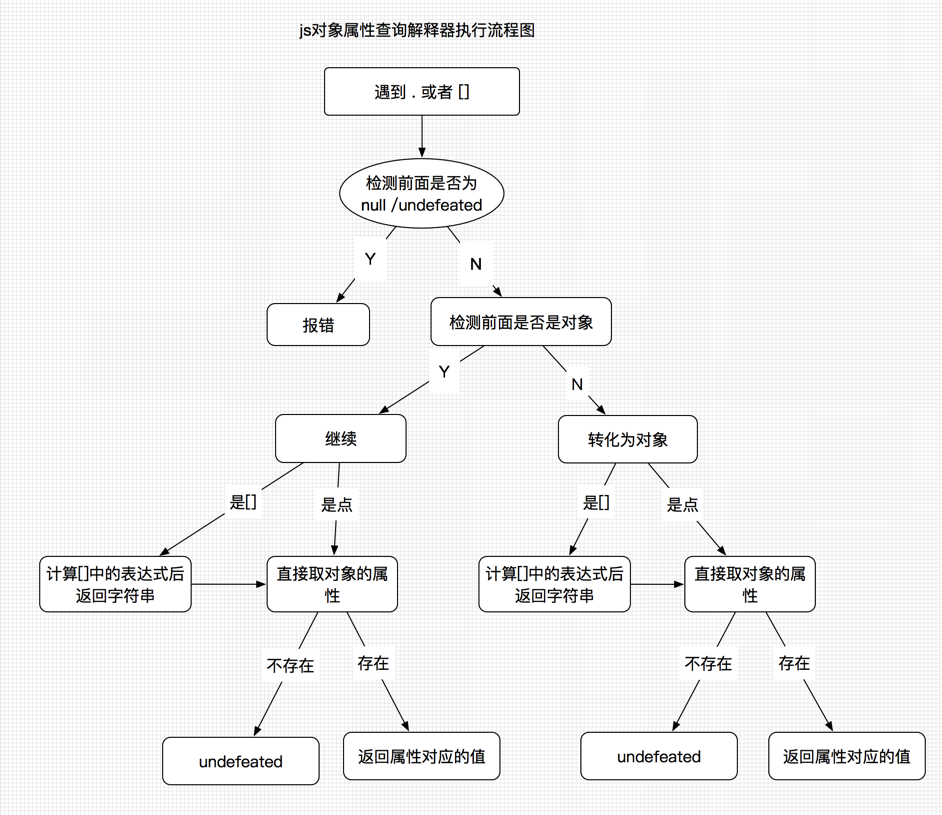

# 数组的使用

## 对象回顾

回顾：

**对象**：是在js当中有各种属性名称以及属性的名称所对应的值所组成的无序的合集。

* **对象分类**：

  - 内部对象  

    > 不需要使用new操作符 

    - 错误对象

    - 内置对象

      Math  JSON Global

    - 常用对象

      布尔类型Boolean，字符串类型String，数字类型Number，数组Array，时间Date，函数function ，对象Object，正则表达式RegExp

  - 宿主对象

    js运行环境 window Document 

  - 自定义对象

    其他所有对象

* **对象创建：**

  - new操作符

    `new Object()`  不需要传值后面的（）可以省略

  - 对象字面量

    ```js
    var person = {
        name : "Nicholas",
        age : 29
    };
    ```

  - ES5创建对象方法

    Object.create(原型,对象描述信息)

* **对象的访问：**

  > 两种方式在本质上没有区别

  - 使用“.”

  - 使用“[]”

    属性是个变量时使用 []，属性中包含特殊字符使用[]

  

基础数据类型中的**null 为什么在typeof操作符下返回 object** ?

在计算机中所有的变量都是保存在内存当中的。所有的数据在内存中都是以2进制进行保存的。js的解释器进行编译的时候有这样的规则：如果一个数据它转换为二进制后前3位都是0的话，这时使用typeof查看的时候得到的就是Object。也就是说如果把一个数据转化为二进制，当它的前三位都是0的话就表示这个东西是个对象。null转化为二进制都是0，所以后面追加了undefined

## 数组

数组都是数据的有序列表。

* js数组特性：
  * 每一项可以放任何类型数据
  * 数组大小可一随意调整

* 创建：
  * Array构造函数

    ```js
    var colors = new Array()
    //参数只有一个数字的时候，创建一个空数组参数表示数组的长度。
    var colors = new Array(20) // colors.length >20
    //多个参数时，参数是数组中应该包含的项
    var colors = new Array("red", "blue", "green");
    // 也可省略new操作符
    ```

  * 数组字面量

    ```js
    var colors = ["red", "blue", "green"]
    var colors = [,,,]// 浏览器不兼容
    ```

    > 最后一项不要加“，”逗号
    >
    > 不要用多个，创建空数组

* 读取

  数组的读取使用[] 加上数组索引方式。

  ```js
  var colors = ["red", "blue", "green"]
  colors[0]// red
  ```

  数组也是对象，对象的属性访问方式有两种，使用 . 和 [] 的方式。数组的属性名称是以数字的方式体现的。所以数组的访问要使用 [] 的方式进行提取。

  * 索引从0开始

  * 数组也可以添加其他属性

    ```js
    var colors = ["red", "blue", "green"]
    colors.name = "colorName" 
    colors //["red", "blue", "green", name: "colorName"]
    // 添加的其他属性可以通过 . 和 [] 访问，添加其他属性不在数组排序属性中。
    colors['name'] //"colorName"
    ```

* 写入/修改

  ```js
  var colors = ["red", "blue", "green"]
  colors[2]='yellow' //["red", "blue", "yellow"]
  ```

  * 当给数组写入一个比数组长度大的值，此时数组的长度会对应的改变。

  ```js
  var colors = ["red", "blue", "green"]
  colors [5]= "yellow"
  // ["red", "blue", "green", undefined,undefined, "yellow"]
  ```

  * delet 操作符删除

    ```js
    var colors = ["red", "blue", "green"]
    delete colors[2] // ["red", "blue", undefined]
    ```

    数组长度不会改变，被删除的项为undefined

* 数组长度

  数组也属于对象的一种，只不过是它里面的属性名称是按0-n顺序依次排列出来的。

  数组中有个特殊属性length，他表示数组长度。始终放回正整数（自然数）。

  length值可修改，长度的改变可影响数组

  ```js
  var colors = ["red", "blue", "green"]
  // length值设置大于数组长度时数组会用undefined 填充值
  colors.length = 5 //["red", "blue", "green", undefined,undefined]
  // length值设置小于数组长度时数组会删除多余的值
  colors.length = 2 // ["red", "blue"]
  ```

  设置length的值为其他数据类型时，可以转化为自然数的就转化为自然数。不转化为自然数的报错。

  数组的长度非常大

* 数组的检查

  *  instanceof 操作符

    ```js
    if (value instanceof Array){
    //对数组执行某些操作
    }
    ```

  * constructor

    ```js
    var colors = ["red", "blue", "green"]
    colors.constructor === Array // true
    ```

    **缺点**：instanceof 和 constructor 如果网页中包含多个框架，那实际上就存在两个以上不同的全局执行环境，从而存在两个以上不同版本的 Array 构造函数。如果你从一个框架向另一个框架传入一个数组，那么传入的数组与在第二个框架中原生创建的数组分别具有各自不同的构造函数。

  *  ES5 的Array.isArray()方法

    ```js
    if (Array.isArray(value)){
    	//对数组执行某些操作
    }
    ```

    不用考虑执行环境，但有低版本兼容性

  * 兼容方法

    ```js
    Object.prototype.toString.call(value) == "[object Array]" 
    ```

  **数组检测函数**

  ```js
  function ArrayChect(value){
    if(typeof Array.isArray == "function"){
     	  return Array.isArray(value)
    }else{
        return Object.prototype.toString.call(value) == "[object Array]"
    }
  }
  ```

## 数组操作

****

> ES3方法

* 栈方法

  > 栈是一种 LIFO（Last-In-First-Out，后进先出）的数据结构，也就是最新添加的项最早被移除。而栈中项的插入（叫做推入）和移除（叫做弹出），只发生在一个位置——栈的顶部。（汗摞塔）

  * push()

    可以接收任意数量的参数，把他们逐个添加到数组末尾，并返回修改后的数组的长度。

  * pop()方法

    从数组末尾移除最后一项，减少数组的length值，然后返回移除的项

* 列队方法

  > 队列数据结构的访问规则是 FIFO （First-In-First-Out，先进先出）。队列在列表的末端添加项，从列表的前端移除项。

  * shift()

    移除数组中的第一个项并返回该项，同时将数组长度减1。 

    shift()和 push()结合使用，数组后面添加前面删除

  * unshift()

    可以接收任意数量的参数，把他们逐个添加到数组前端，并返回修改后的数组的长度。

     unshift()和 pop()方法结合使用，数组前面添加后面移除项

* 重排序方法

  * reverse() 

    反转数组项的顺序。

  * sort()

    接受参数是个函数，函数作用是对数组进行自定义排序。

    **默认情况下**：没有参数时，先将数组的每一项转化为字符串，然后按照字符串asce码大小进行排序。

    **比较函数：**接收两个参数，两个参数表示依次比较的时候所用到的两个值，比较从数组的第一个值和第二个值开始依次比较，遇到需要调整位置时，调整后从头开始再比较（冒泡排序）

    ```js
    var values = [0, 1, 5, 10, 15];
    values.sort(compare);
    function compare(value1, value2) {
        if (value1 < value2) {
        	return -1;
        } else if (value1 > value2) {
        	return 1;
        } else {
        	return 0;
        }
    }
    ```

    sort()排序性能问题：

    针对大的数组可以分成两个，分别对两个进行排序。如有1000个值的数组，项把大于500和小于500的值分成两组，然后分别进行sort()排序，最后合并这两个数组。

* 操作方法 

  * join()方法

    使用不同的分隔符来构建这个字符串。

    ```js
    var a= [30,200,55]
    a.join('*') // "30*200*55"
    ```

  * concat()方法

    接受任意数量的参数，依次将参数放到数组的末端。（类似push方法）

    > 基于当前数组中的所有项创建一个新数组。具体来说，这个方法会先创建当前数组一个副本，然后将接收到的参数添加到这个副本的末尾，最后返回新构建的数组。

    跟push()方法比较：

     	1. push() 对原有数组有影响，cancat()对原有数组没有影响
     	2. 参数中有数组的情况下：push()会把是数组的参数当作原有数组的一项，添加到原有数组中。cancat()会把是数组的参数拆开，把每一项添加到原有数组中。

  * slice()方法

    对数组进行截取，返回截取后的数组。接受两个参数，即要返回项的起始和结束位置。

    ```js
    var colors = ["red", "green", "blue", "yellow", "purple"];
    // 不传参数 返回所有
    colors.slice() // "red","green","blue","yellow","purple"
    // 一个参数，从参数的位置到结束
    colors.slice(1); //"green","blue","yellow","purple"
    colors.slice(1,4); //green,blue,yellow
    // 参数时负数，用数组长度加上该数来确定相应的位置。用于取数组尾部值
    colors.slice(-2,-1) // colors.slice(3,4)  "yellow"
    ```

  * splice()方法

    向数组的中部插入项。形成三个功能，删除、插入、替换

    * 一个参数

      从传参数的位置删到最后,返回删除的数组项的值

    * 两个参数（a,b）

      从参数a位置开始删除 b个数组项，返回删除的值

    * 三个参数即以上（a,b,c）

      从参数a位置开始删除 b个数组项，插入c

> 操作方法对原有数组没影响，栈方法、队列方法、重排方法影响原数组

* 位置方法

  返回值都是数字。作用在数组中查找，找到就停，返回找到的值的位置。

  * indexOf()

    从数组前向后找

  * lastIndexOf()

    从数组后向前找

  第一个参数，要查找的项。第二个参数，查找起点位置。没找到返回-1。匹配条件是全等的匹配条件===

  ------

  ES5方法

* 迭代方 法

  接受的参数相同，作用也相同，返回值不同。

  参数：1每一项上要运行的函数，2可选的运行该函数的作用域对象

  作用：对数组中的每一项都运行传入的函数，这个函数都接收三个参数，1数组的项，2索引，3整个数组本身。

  every()  都为true，返回true

  filter()   返回为true的项组成的数组

  forEach()  没有返回

  map() 返回每次函数调用的结果组成的数组

  some() 一个为true就返回true

  ```js
  var numbers = [1,2,3,4,5,4,3,2,1];
  var mapResult = numbers.map(function(item, index, array){
  	return item * 2;
  });
  alert(mapResult); //[2,4,6,8,10,8,6,4,2]
  ```

* 归并方法

  接收两个参数，每一项上调用的函数和可选的座位归并基础的初始值。

  运行的函数接受4个参数：前一个值、当前值、项的索引和数组对象。

  * reduce()  从前向后

  * reduceRight() 从后向前

  > 执行求数组中所有值之和的操作

  ```js
  var values = [1,2,3,4,5];
  var sum = values.reduce(function(prev, cur, index, array){
  	return prev + cur;
  });
  alert(sum); //15
  ```


